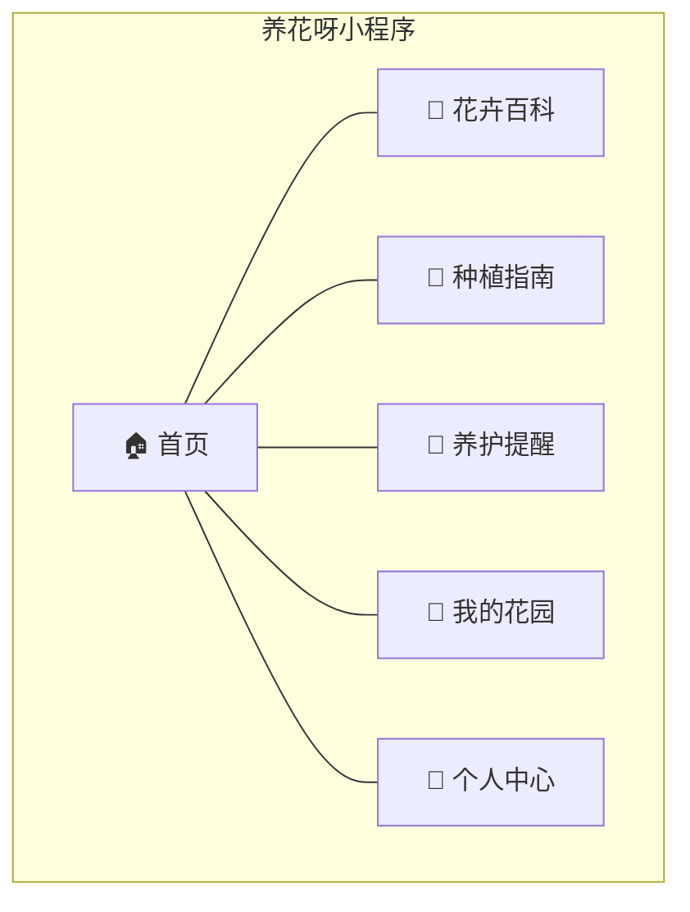
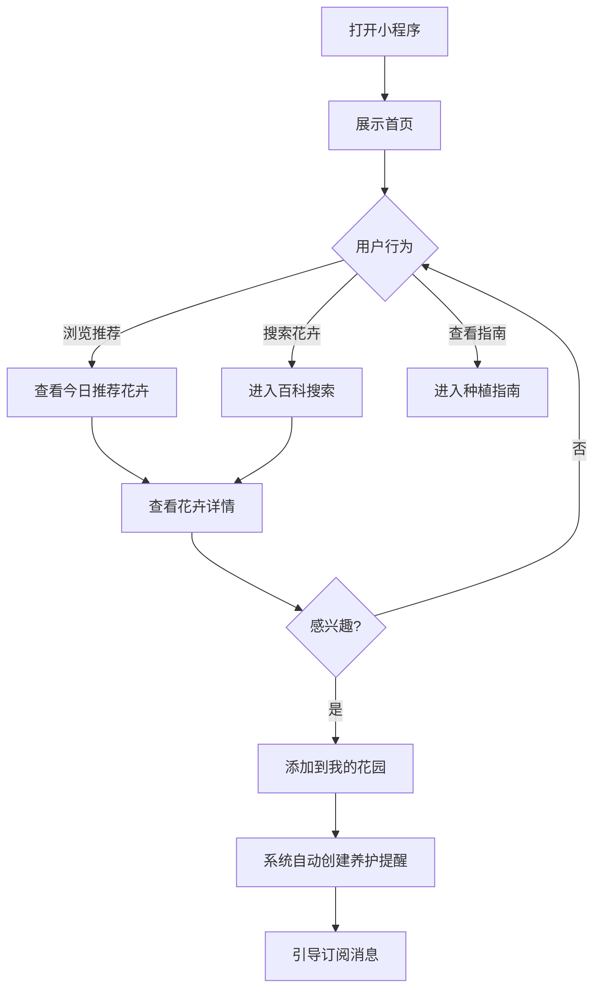
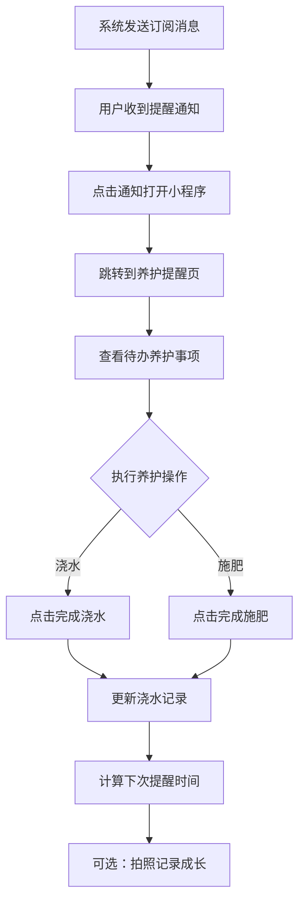
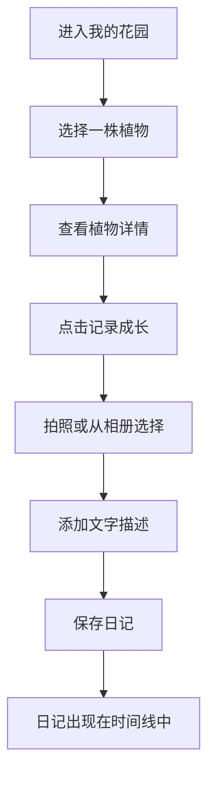

# 🌸 养花呀 — 产品需求文档（PRD）

> **文档版本**：v1.1  
> **创建日期**：2026-04-28  
> **文档状态**：初稿  
> **产品名称**：养花呀  
> **项目代号**：Flora（`flora-miniprogram`）  
> **产品类型**：微信小程序

---

## 目录

- [1. 产品概述](#1-产品概述)
- [2. 用户画像](#2-用户画像)
- [3. 功能模块详述](#3-功能模块详述)
- [4. 页面结构与交互说明](#4-页面结构与交互说明)
- [5. 用户故事](#5-用户故事)
- [6. 花卉数据规格](#6-花卉数据规格)
- [7. 非功能性需求](#7-非功能性需求)
- [8. 版本迭代计划](#8-版本迭代计划)
- [9. 风险与依赖](#9-风险与依赖)

---

## 1. 产品概述

### 1.1 产品定位

**养花呀**（项目代号 Flora）是一款面向花卉种植爱好者的微信小程序，旨在帮助用户：

- 🌺 了解各类花卉的种植知识和养护技巧
- 📖 获取科学的种植指南和病虫害防治方案
- 🔔 通过智能提醒系统，定时提醒浇水、施肥、换盆等养护操作
- 🌱 记录自己植物的成长过程，打造个人花园日记
- 💡 根据季节、地区、经验等级获取个性化的花卉推荐

### 1.2 产品愿景

成为花卉爱好者的**随身种花百科和智能养护管家**，让每个人都能轻松养好花。

### 1.3 目标用户

| 用户类型 | 描述 | 占比预估 |
|---------|------|---------|
| 种花新手 | 刚开始对种花感兴趣，缺乏基础知识 | 50% |
| 有一定经验的花友 | 养过几种花，希望扩展品种、提升养护水平 | 30% |
| 资深花卉爱好者 | 经验丰富，需要工具管理花园、记录成长 | 15% |
| 偶尔养花的用户 | 收到花束/绿植，需要临时查询养护方法 | 5% |

### 1.4 核心价值主张

| 价值点 | 说明 |
|--------|------|
| **知识全面** | 覆盖 50+ 种常见花卉的详细种植百科 |
| **操作指导** | 从播种到开花的分步图文教程 |
| **智能提醒** | 根据花卉特性自动生成养护提醒 |
| **成长记录** | 拍照记录植物成长，见证每一次绽放 |
| **个性推荐** | 根据用户条件推荐最适合的花卉品种 |

### 1.5 商业模式（远期规划）

- 广告收入（Banner 广告、激励视频）
- 电商导购（花种、花盆、工具、土壤等园艺用品）
- 增值服务（高级花卉识别、专家在线咨询）

---

## 2. 用户画像

### 2.1 典型用户 A — 小白花友「小美」

| 属性 | 描述 |
|------|------|
| **年龄** | 25 岁 |
| **职业** | 公司职员 |
| **场景** | 在社交媒体看到别人晒花，心动想自己种 |
| **痛点** | 不知道种什么花、怎么种、怎么养；花经常养死 |
| **需求** | 需要新手友好的花卉推荐和保姆级教程 |
| **期望** | 打开小程序就能找到适合自己的花和详细教程 |

### 2.2 典型用户 B — 进阶花友「老王」

| 属性 | 描述 |
|------|------|
| **年龄** | 45 岁 |
| **职业** | 退休教师 |
| **场景** | 家中阳台养了十几盆花，品种越来越多 |
| **痛点** | 花多了记不住每种花的养护周期，偶尔忘浇水 |
| **需求** | 养护提醒功能 + 花卉管理工具 |
| **期望** | 添加自己的花，系统自动提醒养护时间 |

### 2.3 典型用户 C — 偶尔种花「小张」

| 属性 | 描述 |
|------|------|
| **年龄** | 30 岁 |
| **职业** | 设计师 |
| **场景** | 朋友送了一盆绿萝，不知道怎么养 |
| **痛点** | 临时需要查某种花的养护方法 |
| **需求** | 快速搜索或拍照识别花卉，查看养护要点 |
| **期望** | 3 秒内找到想要的花卉养护信息 |

---

## 3. 功能模块详述

### 3.1 模块概览



### 3.2 首页模块

**功能目标**：作为用户进入小程序的第一屏，展示核心内容推荐，引导用户探索各功能。

| 功能点 | 描述 | 优先级 |
|--------|------|--------|
| 搜索栏 | 支持花卉名称模糊搜索，快速跳转到花卉详情 | P0 |
| 今日推荐花卉 | 根据当前季节推荐 1-3 种适合种植的花卉，展示卡片 | P0 |
| 养花小贴士 | 每日一条实用养花知识，支持切换查看历史 | P1 |
| 当季花历 | 展示当前月份适合种植/赏花的花卉列表 | P1 |
| 快捷入口 | 花卉百科、种植指南、我的花园、养护提醒的图标入口 | P0 |
| 热门花卉排行 | 展示用户浏览/收藏最多的花卉 TOP 10 | P2 |

### 3.3 花卉百科模块

**功能目标**：提供全面、详尽的花卉知识库，帮助用户了解各种花卉的特性与养护要点。

#### 3.3.1 花卉列表页

| 功能点 | 描述 | 优先级 |
|--------|------|--------|
| 分类浏览 | 按分类筛选：草本/木本、室内/室外、观花/观叶/观果 | P0 |
| 季节筛选 | 按适宜种植季节筛选：春/夏/秋/冬/四季 | P0 |
| 难度筛选 | 按种植难度筛选：新手友好(1-2星) / 中等(3星) / 进阶(4-5星) | P0 |
| 搜索功能 | 支持花卉名称、别名的模糊搜索 | P0 |
| 排序方式 | 默认推荐 / 按难度升序 / 按热度降序 | P1 |
| 拍照识花 | 调用相机拍照，AI 识别花卉品种（可选功能，v2） | P2 |

#### 3.3.2 花卉详情页

| 信息板块 | 内容 | 优先级 |
|----------|------|--------|
| **基础信息** | 名称、别名、科属、原产地、花卉图片（多张） | P0 |
| **花语寓意** | 花语、文化含义、适合送人的场景 | P1 |
| **种植要素** | 适宜温度范围、光照需求、土壤要求、适宜种植季节 | P0 |
| **养护要点** | 浇水频率与方法、施肥周期与用量、修剪要点 | P0 |
| **土壤配比** | 推荐土壤配方（如：泥炭土:珍珠岩:蛭石 = 3:1:1） | P0 |
| **种植教程** | 分步骤图文教程：选种→育苗→移栽→日常养护→开花 | P0 |
| **病虫害防治** | 常见病害（白粉病、黑斑病等）及防治方法 | P0 |
| **种植难度** | 1-5 星评级 + 难度说明 | P0 |
| **添加到花园** | 一键将该花添加到"我的花园"，开始跟踪养护 | P0 |
| **收藏/分享** | 收藏花卉、分享到朋友圈/好友 | P1 |

### 3.4 种植指南模块

**功能目标**：提供系统化的种植知识教程，从新手入门到进阶技巧。

| 功能点 | 描述 | 优先级 |
|--------|------|--------|
| **新手入门** | 种花前的准备、基本工具清单、土壤基础知识 | P0 |
| **播种教程** | 各类花卉的播种方法（直播、育苗、扦插、分株等） | P0 |
| **土壤配比大全** | 不同花卉类型对应的土壤配方和选购建议 | P0 |
| **浇水指南** | 不同季节的浇水原则、常见浇水误区 | P0 |
| **施肥指南** | 肥料种类介绍、施肥时机与方法 | P0 |
| **病虫害图鉴** | 常见病虫害对照图 + 症状描述 + 防治方案 | P0 |
| **季节养护** | 春/夏/秋/冬各季节通用养护要点 | P1 |
| **进阶技巧** | 嫁接、水培、组合盆栽等进阶内容 | P2 |

#### 指南详情页

- 图文混排的长文章格式
- 支持步骤分段展示
- 包含配图/示意图
- 底部相关花卉推荐

### 3.5 养护提醒模块

**功能目标**：根据用户添加的植物，智能生成个性化养护提醒，确保植物得到及时照料。

| 功能点 | 描述 | 优先级 |
|--------|------|--------|
| **提醒总览** | 日历视图展示近期所有养护事项 | P0 |
| **浇水提醒** | 根据花卉属性自动计算下次浇水时间 | P0 |
| **施肥提醒** | 根据花卉属性自动计算下次施肥时间 | P0 |
| **换盆提醒** | 根据季节和花卉生长周期提醒换盆 | P1 |
| **季节预警** | 入冬/入夏等季节变化时的特殊养护提醒 | P1 |
| **自定义提醒** | 用户可以手动添加自定义养护提醒 | P2 |
| **消息推送** | 通过微信订阅消息推送提醒到用户手机 | P0 |
| **完成打卡** | 用户完成养护操作后标记为已完成 | P0 |

#### 提醒生成逻辑

```
当用户将花卉添加到"我的花园"时：
1. 读取该花卉的养护参数（浇水间隔、施肥间隔等）
2. 以添加日期为基准，自动生成首个提醒周期
3. 用户完成浇水/施肥操作并打卡后，重新计算下一次提醒时间
4. 通过微信订阅消息在提醒时间推送通知
```

### 3.6 我的花园模块

**功能目标**：用户的个人花卉管理空间，管理正在养护的植物并记录成长。

| 功能点 | 描述 | 优先级 |
|--------|------|--------|
| **花园总览** | 展示用户当前所有在养植物的卡片列表 | P0 |
| **添加植物** | 从花卉百科中选择花卉添加，可自定义昵称和照片 | P0 |
| **植物详情** | 查看单株植物的养护日历和成长记录 | P0 |
| **成长日记** | 拍照 + 文字记录植物每日/每周成长变化 | P0 |
| **养护日历** | 时间线形式展示该植物的所有养护操作记录 | P1 |
| **移除植物** | 标记植物已移除（不删除历史记录） | P1 |
| **花园统计** | 展示养花总数、养护天数、日记数等统计数据 | P2 |

### 3.7 个人中心模块

| 功能点 | 描述 | 优先级 |
|--------|------|--------|
| **用户信息** | 头像、昵称、所在地区 | P0 |
| **经验等级** | 根据使用时长和花园植物数量计算 | P2 |
| **我的收藏** | 收藏的花卉列表 | P1 |
| **消息通知** | 提醒消息的历史记录 | P1 |
| **意见反馈** | 用户反馈入口 | P1 |
| **关于我们** | 小程序介绍、版本信息 | P2 |

---

## 4. 页面结构与交互说明

### 4.1 页面清单

| 序号 | 页面路径 | 页面名称 | 所属 Tab | 说明 |
|------|----------|----------|----------|------|
| 1 | `pages/index/index` | 首页 | ✅ Tab 1 | 推荐内容、快捷入口 |
| 2 | `pages/encyclopedia/index` | 花卉百科列表 | ✅ Tab 2 | 花卉分类浏览与搜索 |
| 3 | `pages/encyclopedia/detail` | 花卉详情 | - | 单个花卉的完整信息 |
| 4 | `pages/guide/index` | 种植指南列表 | ✅ Tab 3 | 指南分类浏览 |
| 5 | `pages/guide/detail` | 指南详情 | - | 单篇指南的图文详情 |
| 6 | `pages/garden/index` | 我的花园 | ✅ Tab 4 | 个人植物管理 |
| 7 | `pages/garden/plant-detail` | 植物详情 | - | 单株植物的养护记录 |
| 8 | `pages/garden/diary-edit` | 日记编辑 | - | 添加/编辑成长日记 |
| 9 | `pages/reminder/index` | 养护提醒 | - | 提醒日历总览 |
| 10 | `pages/profile/index` | 个人中心 | - | 用户信息与设置 |

### 4.2 底部 Tab 栏设计

```
┌──────────────────────────────────────────┐
│           小程序内容区域                    │
├──────────┬──────────┬──────────┬──────────┤
│  🏠 首页  │ 🌺 百科  │ 📖 指南  │ 🌱 花园  │
└──────────┴──────────┴──────────┴──────────┘
```

### 4.3 核心交互流程

#### 4.3.1 新用户首次使用流程



#### 4.3.2 养护提醒流程



#### 4.3.3 成长日记记录流程



---

## 5. 用户故事

### 5.1 花卉百科相关

| ID | 角色 | 用户故事 | 验收标准 |
|----|------|----------|----------|
| US-001 | 种花新手 | 作为新手，我想按难度筛选花卉，找到适合入门的品种 | 点击"新手友好"筛选后，展示难度1-2星的花卉列表 |
| US-002 | 花卉爱好者 | 作为花友，我想搜索特定花卉，快速找到养护信息 | 输入花名后 1 秒内展示搜索结果 |
| US-003 | 花卉爱好者 | 作为花友，我想查看花卉的详细种植教程，学习如何从种子种起 | 详情页展示分步骤图文教程 |
| US-004 | 花卉爱好者 | 作为花友，我想了解花卉常见病虫害，学会预防和治疗 | 详情页展示病虫害列表和对应防治方案 |
| US-005 | 用户 | 作为用户，我想根据当前季节了解适合种什么花 | 首页和百科均支持按季节筛选 |

### 5.2 种植指南相关

| ID | 角色 | 用户故事 | 验收标准 |
|----|------|----------|----------|
| US-006 | 种花新手 | 作为新手，我想看入门教程，了解种花的基本步骤 | 提供新手入门系列指南 |
| US-007 | 花卉爱好者 | 作为花友，我想了解不同花卉的土壤配比方案 | 指南中提供具体的配比比例和材料说明 |
| US-008 | 花卉爱好者 | 作为花友，我想学习正确的浇水和施肥方法 | 提供浇水/施肥的频率、用量、注意事项 |

### 5.3 养护提醒相关

| ID | 角色 | 用户故事 | 验收标准 |
|----|------|----------|----------|
| US-009 | 花卉爱好者 | 作为花友，我想收到浇水提醒，不再忘记给花浇水 | 添加植物后自动生成浇水提醒并推送订阅消息 |
| US-010 | 花卉爱好者 | 作为花友，我想记录每次养护操作，追踪养护历史 | 完成浇水/施肥后可打卡记录 |
| US-011 | 花卉爱好者 | 作为花友，入冬前我想收到搬花入室内的提醒 | 系统根据季节和花卉特性发送季节预警 |

### 5.4 我的花园相关

| ID | 角色 | 用户故事 | 验收标准 |
|----|------|----------|----------|
| US-012 | 花卉爱好者 | 作为花友，我想把我正在养的花添加到花园里统一管理 | 从百科详情一键添加，支持自定义昵称 |
| US-013 | 花卉爱好者 | 作为花友，我想拍照记录花的成长过程 | 支持拍照+文字，展示在时间线中 |
| US-014 | 花卉爱好者 | 作为花友，我想查看我的养花统计数据 | 展示养花总数、天数、日记数等 |

---

## 6. 花卉数据规格

### 6.1 花卉信息字段定义

每种花卉需要录入以下完整信息：

#### 基础信息

| 字段 | 类型 | 必填 | 说明 | 示例 |
|------|------|------|------|------|
| `name` | String | ✅ | 花卉名称 | "月季" |
| `alias` | Array\<String\> | ❌ | 别名列表 | ["月月红", "玫瑰（通俗）"] |
| `scientificName` | String | ❌ | 学名 | "Rosa chinensis" |
| `family` | String | ✅ | 科属 | "蔷薇科蔷薇属" |
| `origin` | String | ❌ | 原产地 | "中国" |
| `images` | Array\<String\> | ✅ | 花卉图片URL列表（至少3张） | [...] |
| `coverImage` | String | ✅ | 封面图URL | "cloud://xxx" |
| `description` | String | ✅ | 简介（100-200字） | "月季被誉为..." |

#### 花语与文化

| 字段 | 类型 | 必填 | 说明 | 示例 |
|------|------|------|------|------|
| `flowerLanguage` | String | ✅ | 花语 | "爱情、美丽、希望" |
| `culturalMeaning` | String | ❌ | 文化寓意 | "在中国文化中..." |
| `giftScenarios` | Array\<String\> | ❌ | 适合送人的场景 | ["情人节", "母亲节"] |

#### 种植要素

| 字段 | 类型 | 必填 | 说明 | 示例 |
|------|------|------|------|------|
| `difficulty` | Number(1-5) | ✅ | 种植难度等级 | 3 |
| `difficultyDesc` | String | ✅ | 难度说明 | "需要定期修剪和防病虫害" |
| `season` | Array\<String\> | ✅ | 适宜种植季节 | ["春", "秋"] |
| `bloomSeason` | Array\<String\> | ❌ | 花期 | ["4月", "5月", "6月"] |
| `temperature` | Object | ✅ | 适宜温度 | {"min": 15, "max": 28, "desc": "15-28℃最佳"} |
| `light` | String | ✅ | 光照需求 | "全日照，每天至少6小时直射光" |
| `lightLevel` | String | ✅ | 光照等级 | "强光" / "半阴" / "耐阴" |
| `humidity` | String | ❌ | 湿度需求 | "适中，40%-60%" |

#### 养护要点

| 字段 | 类型 | 必填 | 说明 | 示例 |
|------|------|------|------|------|
| `waterDays` | Number | ✅ | 浇水间隔天数（用于提醒） | 3 |
| `waterMethod` | String | ✅ | 浇水方法详述 | "见干见湿，不可积水..." |
| `waterSeasonTips` | Object | ❌ | 不同季节浇水提示 | {"spring": "...", "summer": "..."} |
| `fertilizeDays` | Number | ✅ | 施肥间隔天数（用于提醒） | 15 |
| `fertilizeMethod` | String | ✅ | 施肥方法详述 | "生长期每15天施一次..." |
| `fertilizeType` | String | ❌ | 推荐肥料类型 | "复合肥、有机肥" |
| `pruningTips` | String | ❌ | 修剪要点 | "花后及时修剪残花..." |
| `repotCycle` | String | ❌ | 换盆周期 | "每年春季换盆一次" |
| `indoorTips` | String | ❌ | 室内养护特别提示 | "冬季入冬前搬入室内..." |

#### 土壤配比

| 字段 | 类型 | 必填 | 说明 | 示例 |
|------|------|------|------|------|
| `soilRecipe` | Object | ✅ | 推荐土壤配方 | 见下方示例 |
| `soilPH` | String | ❌ | 土壤酸碱度要求 | "微酸性 pH 5.5-6.5" |
| `soilDrainage` | String | ❌ | 排水要求 | "排水良好" |

`soilRecipe` 字段示例：

```json
{
  "name": "月季专用土",
  "components": [
    {"material": "泥炭土", "ratio": 4, "desc": "提供有机质和保水性"},
    {"material": "珍珠岩", "ratio": 2, "desc": "增加透气性"},
    {"material": "蛭石", "ratio": 1, "desc": "保水保肥"},
    {"material": "河沙", "ratio": 1, "desc": "增加排水性"}
  ],
  "tips": "可加入适量骨粉作底肥"
}
```

#### 种植教程（分步骤）

| 字段 | 类型 | 必填 | 说明 | 示例 |
|------|------|------|------|------|
| `plantingGuide` | Array\<Object\> | ✅ | 分步种植教程 | 见下方示例 |

`plantingGuide` 字段示例：

```json
[
  {
    "step": 1,
    "title": "选种与准备",
    "content": "选择健壮的月季苗，检查根系是否完整...",
    "image": "cloud://xxx/step1.jpg",
    "tips": "建议选择嫁接苗，更容易成活"
  },
  {
    "step": 2,
    "title": "盆土准备",
    "content": "准备直径20cm以上的花盆，底部铺碎瓦片...",
    "image": "cloud://xxx/step2.jpg",
    "tips": "花盆底部必须有排水孔"
  },
  {
    "step": 3,
    "title": "栽种",
    "content": "将月季苗放入盆中，填土至根颈处...",
    "image": "cloud://xxx/step3.jpg",
    "tips": "栽种后浇透定根水"
  },
  {
    "step": 4,
    "title": "日常养护",
    "content": "放置在通风良好的全日照环境...",
    "image": "cloud://xxx/step4.jpg",
    "tips": "新栽种的月季一周内避免强光直射"
  },
  {
    "step": 5,
    "title": "开花管理",
    "content": "花蕾出现后适当增加磷钾肥...",
    "image": "cloud://xxx/step5.jpg",
    "tips": "第一批花蕾可适当摘除以促进植株健壮"
  }
]
```

#### 病虫害防治

| 字段 | 类型 | 必填 | 说明 | 示例 |
|------|------|------|------|------|
| `diseases` | Array\<Object\> | ✅ | 常见病虫害列表 | 见下方示例 |

`diseases` 字段示例：

```json
[
  {
    "name": "白粉病",
    "type": "病害",
    "symptoms": "叶片表面出现白色粉状物，严重时叶片卷曲枯萎",
    "cause": "高湿度、通风不良",
    "prevention": "保持通风，避免叶面浇水",
    "treatment": "喷施多菌灵或粉锈宁，每7天一次，连续3次",
    "image": "cloud://xxx/disease1.jpg"
  },
  {
    "name": "蚜虫",
    "type": "虫害",
    "symptoms": "嫩芽和花蕾处聚集绿色/黑色小虫，叶片卷曲发黄",
    "cause": "春季温暖潮湿环境",
    "prevention": "定期检查嫩芽，搭配种植薰衣草驱虫",
    "treatment": "少量可用水冲洗，严重时喷施吡虫啉",
    "image": "cloud://xxx/pest1.jpg"
  }
]
```

#### 分类标签

| 字段 | 类型 | 必填 | 说明 | 示例 |
|------|------|------|------|------|
| `category` | String | ✅ | 主分类 | "观花植物" |
| `subCategory` | String | ❌ | 子分类 | "灌木花卉" |
| `tags` | Array\<String\> | ✅ | 标签 | ["室外", "阳台", "庭院", "四季开花"] |
| `isIndoor` | Boolean | ✅ | 是否适合室内 | false |
| `plantType` | String | ✅ | 植物类型 | "草本" / "木本" / "藤本" / "多肉" |

### 6.2 初始花卉数据清单（第一版 50 种）

#### 🌸 观花植物（20种）

| 序号 | 名称 | 难度 | 类型 | 室内/室外 |
|------|------|------|------|-----------|
| 1 | 月季 | ⭐⭐⭐ | 木本 | 室外 |
| 2 | 茉莉花 | ⭐⭐ | 木本 | 室内外 |
| 3 | 栀子花 | ⭐⭐⭐ | 木本 | 室内外 |
| 4 | 太阳花（松叶牡丹） | ⭐ | 草本 | 室外 |
| 5 | 矮牵牛 | ⭐⭐ | 草本 | 室外 |
| 6 | 三角梅 | ⭐⭐ | 木本 | 室外 |
| 7 | 长寿花 | ⭐ | 草本 | 室内 |
| 8 | 天竺葵 | ⭐⭐ | 草本 | 室内外 |
| 9 | 绣球花 | ⭐⭐⭐ | 木本 | 室外 |
| 10 | 兰花（蝴蝶兰） | ⭐⭐⭐⭐ | 草本 | 室内 |
| 11 | 向日葵 | ⭐ | 草本 | 室外 |
| 12 | 百合 | ⭐⭐⭐ | 草本 | 室内外 |
| 13 | 菊花 | ⭐⭐ | 草本 | 室外 |
| 14 | 桂花 | ⭐⭐⭐ | 木本 | 室外 |
| 15 | 玫瑰 | ⭐⭐⭐ | 木本 | 室外 |
| 16 | 牡丹 | ⭐⭐⭐⭐ | 木本 | 室外 |
| 17 | 杜鹃花 | ⭐⭐⭐ | 木本 | 室内外 |
| 18 | 水仙花 | ⭐⭐ | 草本 | 室内 |
| 19 | 郁金香 | ⭐⭐⭐ | 草本 | 室外 |
| 20 | 康乃馨 | ⭐⭐ | 草本 | 室外 |

#### 🌿 观叶植物（15种）

| 序号 | 名称 | 难度 | 类型 | 室内/室外 |
|------|------|------|------|-----------|
| 21 | 绿萝 | ⭐ | 藤本 | 室内 |
| 22 | 吊兰 | ⭐ | 草本 | 室内 |
| 23 | 龟背竹 | ⭐ | 草本 | 室内 |
| 24 | 虎皮兰 | ⭐ | 草本 | 室内 |
| 25 | 文竹 | ⭐⭐ | 草本 | 室内 |
| 26 | 富贵竹 | ⭐ | 草本 | 室内 |
| 27 | 发财树 | ⭐⭐ | 木本 | 室内 |
| 28 | 铜钱草 | ⭐ | 草本 | 室内外 |
| 29 | 橡皮树 | ⭐⭐ | 木本 | 室内 |
| 30 | 琴叶榕 | ⭐⭐⭐ | 木本 | 室内 |
| 31 | 常春藤 | ⭐ | 藤本 | 室内 |
| 32 | 万年青 | ⭐ | 草本 | 室内 |
| 33 | 散尾葵 | ⭐⭐ | 木本 | 室内 |
| 34 | 鸟巢蕨 | ⭐⭐ | 草本 | 室内 |
| 35 | 彩叶芋 | ⭐⭐⭐ | 草本 | 室内 |

#### 🌵 多肉植物（10种）

| 序号 | 名称 | 难度 | 类型 | 室内/室外 |
|------|------|------|------|-----------|
| 36 | 多肉拼盘（混合） | ⭐ | 多肉 | 室内 |
| 37 | 玉露 | ⭐⭐ | 多肉 | 室内 |
| 38 | 仙人掌 | ⭐ | 多肉 | 室内 |
| 39 | 石莲花 | ⭐ | 多肉 | 室内 |
| 40 | 芦荟 | ⭐ | 多肉 | 室内 |
| 41 | 景天 | ⭐ | 多肉 | 室内 |
| 42 | 熊童子 | ⭐⭐ | 多肉 | 室内 |
| 43 | 生石花 | ⭐⭐⭐ | 多肉 | 室内 |
| 44 | 法师 | ⭐⭐ | 多肉 | 室内外 |
| 45 | 碧玉莲 | ⭐⭐ | 多肉 | 室内 |

#### 🌳 果蔬花卉（5种）

| 序号 | 名称 | 难度 | 类型 | 室内/室外 |
|------|------|------|------|-----------|
| 46 | 草莓 | ⭐⭐ | 草本 | 室外 |
| 47 | 小番茄 | ⭐⭐ | 草本 | 室外 |
| 48 | 薄荷 | ⭐ | 草本 | 室内外 |
| 49 | 辣椒 | ⭐⭐ | 草本 | 室外 |
| 50 | 柠檬 | ⭐⭐⭐ | 木本 | 室外 |

---

## 7. 非功能性需求

### 7.1 性能需求

| 指标 | 要求 |
|------|------|
| 首屏加载时间 | ≤ 2 秒 |
| 搜索响应时间 | ≤ 1 秒 |
| 图片加载 | 使用懒加载，缩略图 ≤ 100KB |
| 小程序包体积 | 主包 ≤ 2MB，总体 ≤ 16MB |

### 7.2 兼容性需求

| 平台 | 最低版本 |
|------|----------|
| 微信 | 基础库 2.25.0+ |
| iOS | iOS 12+ |
| Android | Android 7.0+ |

### 7.3 数据安全

- 用户数据仅通过云开发安全规则访问
- 图片上传需限制格式（jpg/png/webp）和大小（≤ 5MB）
- 不收集敏感个人信息

### 7.4 可用性

- 支持深色模式（v2 迭代）
- 无障碍支持：图片提供 alt 描述
- 空状态友好提示（花园为空时引导添加）

---

## 8. 版本迭代计划

### v1.0 — 基础版（首发）

| 模块 | 包含功能 |
|------|----------|
| 首页 | 今日推荐、搜索、快捷入口、当季花历 |
| 花卉百科 | 分类浏览、搜索、花卉详情（全部字段） |
| 种植指南 | 新手入门、播种教程、土壤/浇水/施肥指南、病虫害图鉴 |
| 我的花园 | 添加植物、成长日记、养护日历 |
| 养护提醒 | 浇水/施肥提醒、完成打卡、订阅消息推送 |
| 个人中心 | 基本信息、我的收藏、意见反馈 |

### v1.5 — 体验优化版

| 新增/优化 | 说明 |
|-----------|------|
| 换盆提醒 | 季节性换盆提醒 |
| 季节预警 | 入冬/入夏预警通知 |
| 深色模式 | 适配系统深色模式 |
| 花园统计 | 养花数据统计展示 |
| 热门排行 | 花卉热度排行榜 |

### v2.0 — 智能版

| 新增功能 | 说明 |
|----------|------|
| 拍照识花 | AI 识别花卉品种 |
| 智能推荐 | 根据地区、季节、经验个性化推荐 |
| 自定义提醒 | 用户自定义养护提醒 |
| 社区分享 | 花友社区、晒花动态 |

### v3.0 — 商业版（远期）

| 新增功能 | 说明 |
|----------|------|
| 电商导购 | 花种、花盆、工具等商品推荐 |
| 专家咨询 | 在线花卉专家问答 |
| 会员体系 | 高级功能解锁 |

---

## 9. 风险与依赖

### 9.1 风险评估

| 风险 | 影响 | 概率 | 应对策略 |
|------|------|------|----------|
| 花卉数据录入工作量大 | 延迟上线 | 高 | 分批录入，v1先做30种核心花卉 |
| 花卉图片版权问题 | 法律风险 | 中 | 使用正版图库或自行拍摄 |
| 订阅消息用户不授权 | 提醒功能受限 | 中 | 提供小程序内提醒作为兜底 |
| 云开发免费额度不足 | 运营成本增加 | 低 | 初期用户量小，免费额度足够 |

### 9.2 外部依赖

| 依赖项 | 说明 | 是否必须 |
|--------|------|----------|
| 微信小程序账号 | 需要注册并认证 | ✅ 必须 |
| 微信云开发 | 后端服务 | ✅ 必须 |
| 花卉图片资源 | 50种花卉的高质量图片 | ✅ 必须 |
| 花卉数据内容 | 专业的花卉养护知识 | ✅ 必须 |
| 百度识图 API | 拍照识花功能（v2） | ❌ 可选 |

---

> 📝 **文档更新记录**
>
> | 版本 | 日期 | 修改内容 | 作者 |
> |------|------|----------|------|
> | v1.0 | 2026-04-28 | 初稿创建 | AI Assistant |
