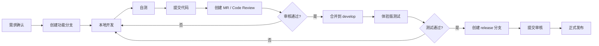

# 📐 养花呀（Flora）— 开发规范文档

> **文档版本**：v1.0  
> **创建日期**：2026-04-28  
> **项目代号**：Flora（`flora-miniprogram`）  
> **技术栈**：微信小程序原生开发 + 微信云开发  
> **关联文档**：[PRD](./PRD-花卉种植助手产品需求文档.md) | [技术设计文档](./技术设计文档.md)

---

## 目录

- [1. 项目目录结构](#1-项目目录结构)
- [2. 命名规范](#2-命名规范)
- [3. WXML 编码规范](#3-wxml-编码规范)
- [4. WXSS 编码规范](#4-wxss-编码规范)
- [5. JavaScript 编码规范](#5-javascript-编码规范)
- [6. 组件开发规范](#6-组件开发规范)
- [7. 云函数开发规范](#7-云函数开发规范)
- [8. 数据交互规范](#8-数据交互规范)
- [9. 图片与资源规范](#9-图片与资源规范)
- [10. Git 分支与提交规范](#10-git-分支与提交规范)
- [11. 开发流程与协作](#11-开发流程与协作)
- [12. 代码审查清单](#12-代码审查清单)

---

## 1. 项目目录结构

### 1.1 完整目录结构

```
flora-miniprogram/
│
├── cloudfunctions/                     # ☁️ 云函数目录
│   ├── flower/                        # 花卉百科云函数
│   │   ├── actions/                   # 各操作处理器
│   │   │   ├── list.js
│   │   │   ├── detail.js
│   │   │   ├── search.js
│   │   │   └── recommend.js
│   │   ├── index.js                   # 入口文件（路由分发）
│   │   ├── config.json                # 云函数配置
│   │   └── package.json
│   │
│   ├── user/                          # 用户管理云函数
│   │   ├── actions/
│   │   │   ├── login.js
│   │   │   ├── updateInfo.js
│   │   │   ├── toggleFavorite.js
│   │   │   ├── getFavorites.js
│   │   │   └── getStats.js
│   │   ├── index.js
│   │   ├── config.json
│   │   └── package.json
│   │
│   ├── plant/                         # 我的植物云函数
│   │   ├── actions/
│   │   │   ├── add.js
│   │   │   ├── list.js
│   │   │   ├── update.js
│   │   │   └── remove.js
│   │   ├── index.js
│   │   ├── config.json
│   │   └── package.json
│   │
│   ├── diary/                         # 成长日记云函数
│   │   ├── actions/
│   │   │   ├── add.js
│   │   │   ├── list.js
│   │   │   └── delete.js
│   │   ├── index.js
│   │   ├── config.json
│   │   └── package.json
│   │
│   ├── reminder/                      # 养护提醒云函数
│   │   ├── actions/
│   │   │   ├── list.js
│   │   │   ├── complete.js
│   │   │   └── push.js
│   │   ├── index.js
│   │   ├── config.json                # 含定时触发器配置
│   │   └── package.json
│   │
│   ├── guide/                         # 种植指南云函数
│   │   ├── actions/
│   │   │   ├── list.js
│   │   │   └── detail.js
│   │   ├── index.js
│   │   ├── config.json
│   │   └── package.json
│   │
│   └── common/                        # 公共服务云函数
│       ├── actions/
│       │   ├── getHomeData.js
│       │   └── getDailyTip.js
│       ├── index.js
│       ├── config.json
│       └── package.json
│
├── miniprogram/                        # 📱 小程序前端目录
│   │
│   ├── pages/                         # 页面目录
│   │   ├── index/                     # 🏠 首页（Tab 1）
│   │   │   ├── index.js
│   │   │   ├── index.json
│   │   │   ├── index.wxml
│   │   │   └── index.wxss
│   │   │
│   │   ├── encyclopedia/             # 🌺 花卉百科（Tab 2）
│   │   │   ├── index.js              # 列表页
│   │   │   ├── index.json
│   │   │   ├── index.wxml
│   │   │   ├── index.wxss
│   │   │   ├── detail.js             # 详情页
│   │   │   ├── detail.json
│   │   │   ├── detail.wxml
│   │   │   └── detail.wxss
│   │   │
│   │   ├── guide/                     # 📖 种植指南（Tab 3）
│   │   │   ├── index.js
│   │   │   ├── index.json
│   │   │   ├── index.wxml
│   │   │   ├── index.wxss
│   │   │   ├── detail.js
│   │   │   ├── detail.json
│   │   │   ├── detail.wxml
│   │   │   └── detail.wxss
│   │   │
│   │   ├── garden/                    # 🌱 我的花园（Tab 4）
│   │   │   ├── index.js
│   │   │   ├── index.json
│   │   │   ├── index.wxml
│   │   │   ├── index.wxss
│   │   │   ├── plant-detail.js       # 植物详情页
│   │   │   ├── plant-detail.json
│   │   │   ├── plant-detail.wxml
│   │   │   ├── plant-detail.wxss
│   │   │   ├── diary-edit.js         # 日记编辑页
│   │   │   ├── diary-edit.json
│   │   │   ├── diary-edit.wxml
│   │   │   └── diary-edit.wxss
│   │   │
│   │   ├── reminder/                  # 🔔 养护提醒
│   │   │   ├── index.js
│   │   │   ├── index.json
│   │   │   ├── index.wxml
│   │   │   └── index.wxss
│   │   │
│   │   └── profile/                   # 👤 个人中心
│   │       ├── index.js
│   │       ├── index.json
│   │       ├── index.wxml
│   │       └── index.wxss
│   │
│   ├── components/                    # 🧩 公共组件
│   │   ├── flower-card/              # 花卉卡片组件
│   │   │   ├── flower-card.js
│   │   │   ├── flower-card.json
│   │   │   ├── flower-card.wxml
│   │   │   └── flower-card.wxss
│   │   │
│   │   ├── plant-card/               # 植物卡片组件
│   │   │   └── ...
│   │   │
│   │   ├── reminder-item/            # 提醒条目组件
│   │   │   └── ...
│   │   │
│   │   ├── diary-item/               # 日记条目组件
│   │   │   └── ...
│   │   │
│   │   ├── search-bar/               # 搜索栏组件
│   │   │   └── ...
│   │   │
│   │   ├── empty-state/              # 空状态组件
│   │   │   └── ...
│   │   │
│   │   ├── loading/                   # 加载中组件
│   │   │   └── ...
│   │   │
│   │   ├── skeleton/                  # 骨架屏组件
│   │   │   └── ...
│   │   │
│   │   └── difficulty-stars/          # 难度星级组件
│   │       └── ...
│   │
│   ├── utils/                         # 🔧 工具函数
│   │   ├── cloud.js                  # 云函数调用封装
│   │   ├── storage.js                # 本地缓存封装
│   │   ├── image.js                  # 图片处理（压缩/上传）
│   │   ├── date.js                   # 日期工具函数
│   │   ├── permission.js             # 权限管理
│   │   └── util.js                   # 通用工具函数
│   │
│   ├── services/                      # 📡 API 服务层
│   │   ├── flower.js                 # 花卉相关接口
│   │   ├── user.js                   # 用户相关接口
│   │   ├── plant.js                  # 植物相关接口
│   │   ├── diary.js                  # 日记相关接口
│   │   ├── reminder.js               # 提醒相关接口
│   │   ├── guide.js                  # 指南相关接口
│   │   └── common.js                 # 公共接口
│   │
│   ├── styles/                        # 🎨 全局样式
│   │   ├── variables.wxss            # 样式变量（颜色、间距、字号等）
│   │   ├── common.wxss               # 通用样式类
│   │   ├── animation.wxss            # 动画样式
│   │   └── icon.wxss                 # 图标样式
│   │
│   ├── images/                        # 🖼️ 本地图片资源
│   │   ├── tabbar/                   # TabBar 图标
│   │   │   ├── home.png
│   │   │   ├── home-active.png
│   │   │   ├── encyclopedia.png
│   │   │   ├── encyclopedia-active.png
│   │   │   ├── guide.png
│   │   │   ├── guide-active.png
│   │   │   ├── garden.png
│   │   │   └── garden-active.png
│   │   ├── icons/                    # 功能图标
│   │   └── placeholder/             # 占位图
│   │       ├── flower-placeholder.png
│   │       └── avatar-placeholder.png
│   │
│   ├── constants/                     # 📋 常量定义
│   │   ├── index.js                  # 导出所有常量
│   │   ├── flower.js                 # 花卉相关常量（分类、难度等）
│   │   └── reminder.js               # 提醒相关常量
│   │
│   ├── app.js                         # 小程序入口
│   ├── app.json                       # 小程序全局配置
│   ├── app.wxss                       # 全局样式
│   └── sitemap.json                   # 搜索配置
│
├── docs/                               # 📚 项目文档
│   ├── PRD-花卉种植助手产品需求文档.md
│   ├── 技术设计文档.md
│   └── 开发规范文档.md
│
├── scripts/                            # 🛠️ 辅助脚本
│   └── init-data.js                   # 初始数据导入脚本
│
├── .gitignore
├── .eslintrc.js                        # ESLint 配置
├── project.config.json                 # 微信开发者工具项目配置
├── project.private.config.json         # 私有配置（不提交 Git）
└── README.md
```

### 1.2 目录说明

| 目录 | 用途 | 注意事项 |
|------|------|----------|
| `cloudfunctions/` | 云函数代码 | 每个云函数独立部署 |
| `miniprogram/pages/` | 页面文件 | 每个页面 4 个文件（js/json/wxml/wxss） |
| `miniprogram/components/` | 可复用组件 | 组件独立，可跨页面引用 |
| `miniprogram/utils/` | 工具函数 | 纯函数，无副作用 |
| `miniprogram/services/` | API 服务层 | 封装云函数调用 |
| `miniprogram/styles/` | 全局样式 | 通过 `@import` 引入 |
| `miniprogram/images/` | 本地图片 | 仅存放 TabBar 图标等必要图片 |
| `miniprogram/constants/` | 常量定义 | 枚举值、配置常量 |

---

## 2. 命名规范

### 2.1 文件与目录命名

| 类型 | 规范 | 示例 | 反例 |
|------|------|------|------|
| 页面目录 | 小写 kebab-case | `plant-detail/` | `plantDetail/` |
| 组件目录 | 小写 kebab-case | `flower-card/` | `FlowerCard/` |
| 页面文件 | 与目录同名 | `plant-detail.js` | `plantDetail.js` |
| 工具文件 | 小写 camelCase | `cloud.js`, `date.js` | `Cloud.js` |
| 服务文件 | 小写 camelCase | `flower.js`, `user.js` | `Flower.js` |
| 常量文件 | 小写 camelCase | `flower.js` | `FLOWER.js` |
| 云函数目录 | 小写 | `flower/`, `user/` | `Flower/` |
| 图片文件 | 小写 kebab-case | `home-active.png` | `homeActive.png` |

### 2.2 JavaScript 命名

| 类型 | 规范 | 示例 |
|------|------|------|
| 变量 | camelCase | `flowerList`, `isLoading` |
| 常量 | UPPER_SNAKE_CASE | `MAX_PAGE_SIZE`, `API_TIMEOUT` |
| 函数 | camelCase，动词开头 | `getFlowerList()`, `handleSubmit()` |
| 类/构造函数 | PascalCase | `FlowerService` |
| 布尔变量 | `is`/`has`/`can`/`should` 前缀 | `isActive`, `hasData`, `canEdit` |
| 事件处理函数 | `on` / `handle` 前缀 | `onTapCard()`, `handleSearch()` |
| 私有方法 | `_` 前缀（可选） | `_formatDate()` |

### 2.3 WXML 命名

| 类型 | 规范 | 示例 |
|------|------|------|
| CSS 类名 | BEM 规范（推荐） | `.flower-card`, `.flower-card__title`, `.flower-card--active` |
| data 属性 | camelCase | `data-flower-id="{{item._id}}"` |
| 自定义属性 | kebab-case | `data-plant-id` |
| 事件绑定 | camelCase | `bind:tap="onTapCard"` |

### 2.4 数据库命名

| 类型 | 规范 | 示例 |
|------|------|------|
| 集合名 | 小写 snake_case | `my_plants`, `grow_diaries` |
| 字段名 | camelCase | `flowerId`, `waterDays`, `isCompleted` |
| 索引名 | 字段名用下划线连接 | `openid_status`, `plantId_createdAt` |

---

## 3. WXML 编码规范

### 3.1 基本规则

```xml
<!-- ✅ 推荐：属性值使用双引号 -->
<view class="container" data-id="{{item._id}}">

<!-- ❌ 避免：属性值使用单引号 -->
<view class='container' data-id='{{item._id}}'>
```

### 3.2 属性换行

```xml
<!-- 属性少于 3 个：单行 -->
<view class="card" bind:tap="onTap">
  <text>{{title}}</text>
</view>

<!-- 属性多于 3 个：换行书写，每个属性一行 -->
<view
  class="flower-card"
  data-id="{{item._id}}"
  bind:tap="onTapCard"
  wx:for="{{flowerList}}"
  wx:key="_id"
>
  <image src="{{item.coverImage}}" mode="aspectFill" />
</view>
```

### 3.3 列表渲染

```xml
<!-- ✅ 推荐：始终使用 wx:key 指定唯一标识 -->
<view wx:for="{{flowers}}" wx:key="_id">
  <flower-card flower="{{item}}" />
</view>

<!-- ✅ 自定义 item/index 变量名（避免嵌套循环冲突）-->
<view wx:for="{{categories}}" wx:for-item="category" wx:for-index="catIdx" wx:key="id">
  <view wx:for="{{category.flowers}}" wx:for-item="flower" wx:key="_id">
    <text>{{flower.name}}</text>
  </view>
</view>

<!-- ❌ 避免：不写 wx:key -->
<view wx:for="{{flowers}}">...</view>
```

### 3.4 条件渲染

```xml
<!-- 频繁切换用 hidden（不会销毁节点）-->
<view hidden="{{!showFilter}}">
  <text>筛选面板</text>
</view>

<!-- 不常显示用 wx:if（按需渲染，节省初始化开销）-->
<view wx:if="{{isLoggedIn}}">
  <text>欢迎回来，{{nickName}}</text>
</view>
<view wx:else>
  <button bind:tap="onLogin">登录</button>
</view>
```

### 3.5 模板引用

```xml
<!-- 使用 <template> 抽离重复结构 -->
<template name="flowerTag">
  <view class="tag tag--{{type}}">
    <text>{{text}}</text>
  </view>
</template>

<!-- 使用模板 -->
<template is="flowerTag" data="{{type: 'indoor', text: '室内'}}" />
```

### 3.6 注释规范

```xml
<!-- 模块注释 -->
<!-- ========== 花卉筛选区域 ========== -->
<view class="filter-section">
  <!-- 分类筛选 -->
  <view class="filter-row">...</view>
  <!-- 难度筛选 -->
  <view class="filter-row">...</view>
</view>
```

---

## 4. WXSS 编码规范

### 4.1 全局样式变量

```css
/* styles/variables.wxss */

/* ===== 品牌色 ===== */
:root {
  /* 主色调 - 绿色系（与花卉种植主题契合） */
  --color-primary: #43A047;
  --color-primary-light: #66BB6A;
  --color-primary-dark: #2E7D32;
  
  /* 辅助色 */
  --color-secondary: #FF8A65;        /* 橙色 - 提醒/警示 */
  --color-accent: #EC407A;           /* 粉色 - 花语/浪漫 */
  --color-info: #42A5F5;             /* 蓝色 - 信息 */
  --color-success: #66BB6A;          /* 绿色 - 成功 */
  --color-warning: #FFA726;          /* 橙色 - 警告 */
  --color-error: #EF5350;            /* 红色 - 错误 */
  
  /* 中性色 */
  --color-text-primary: #333333;
  --color-text-secondary: #666666;
  --color-text-hint: #999999;
  --color-text-disabled: #CCCCCC;
  --color-bg-primary: #FFFFFF;
  --color-bg-secondary: #F5F5F5;
  --color-bg-card: #FFFFFF;
  --color-border: #E8E8E8;
  --color-divider: #F0F0F0;
  
  /* 字号 */
  --font-size-xs: 20rpx;
  --font-size-sm: 24rpx;
  --font-size-md: 28rpx;
  --font-size-base: 30rpx;
  --font-size-lg: 32rpx;
  --font-size-xl: 36rpx;
  --font-size-xxl: 40rpx;
  --font-size-title: 44rpx;
  
  /* 间距 */
  --spacing-xs: 8rpx;
  --spacing-sm: 16rpx;
  --spacing-md: 24rpx;
  --spacing-base: 32rpx;
  --spacing-lg: 40rpx;
  --spacing-xl: 48rpx;
  
  /* 圆角 */
  --radius-sm: 8rpx;
  --radius-md: 12rpx;
  --radius-lg: 16rpx;
  --radius-xl: 24rpx;
  --radius-round: 50%;
  
  /* 阴影 */
  --shadow-sm: 0 2rpx 8rpx rgba(0,0,0,0.06);
  --shadow-md: 0 4rpx 16rpx rgba(0,0,0,0.08);
  --shadow-lg: 0 8rpx 32rpx rgba(0,0,0,0.12);
  
  /* 安全区域 */
  --safe-area-bottom: env(safe-area-inset-bottom);
}
```

### 4.2 BEM 命名方法

```css
/* Block（块）: 独立组件 */
.flower-card { }

/* Element（元素）: 块的子元素，双下划线连接 */
.flower-card__image { }
.flower-card__title { }
.flower-card__tags { }

/* Modifier（修饰符）: 状态变化，双连字符连接 */
.flower-card--large { }
.flower-card--highlighted { }
.flower-card__title--bold { }
```

### 4.3 样式书写顺序

```css
.flower-card {
  /* 1. 布局 */
  display: flex;
  flex-direction: column;
  align-items: center;
  
  /* 2. 定位 */
  position: relative;
  top: 0;
  z-index: 1;
  
  /* 3. 盒模型 */
  width: 100%;
  height: 200rpx;
  padding: 24rpx;
  margin-bottom: 16rpx;
  
  /* 4. 视觉 */
  background: #fff;
  border-radius: 16rpx;
  box-shadow: 0 2rpx 8rpx rgba(0,0,0,0.06);
  
  /* 5. 文字 */
  font-size: 28rpx;
  color: #333;
  line-height: 1.5;
  
  /* 6. 其他 */
  overflow: hidden;
  transition: all 0.3s;
}
```

### 4.4 响应式设计

```css
/* ✅ 使用 rpx 作为主要单位 */
.card {
  width: 690rpx;       /* 屏幕宽度 750rpx - 两侧各 30rpx 间距 */
  padding: 24rpx;
  font-size: 28rpx;
}

/* ✅ 灵活宽度使用百分比 */
.grid-item {
  width: 50%;
  box-sizing: border-box;
}

/* ❌ 避免使用 px（不同屏幕不自适应）*/
.card {
  width: 345px;        /* 不推荐 */
}
```

---

## 5. JavaScript 编码规范

### 5.1 文件结构（页面）

```javascript
// pages/encyclopedia/index.js

// 1. 引入依赖
const flowerService = require('../../services/flower')
const { FLOWER_CATEGORIES, DIFFICULTY_LEVELS } = require('../../constants/flower')

// 2. 页面定义
Page({
  // 2.1 页面数据
  data: {
    flowers: [],
    loading: true,
    hasMore: true,
    page: 1,
    pageSize: 20,
    filter: {
      category: '',
      difficulty: 0,
      season: ''
    }
  },

  // 2.2 生命周期函数
  onLoad(options) {
    this.loadFlowers()
  },

  onShow() {
    // 页面显示时的逻辑
  },

  onReachBottom() {
    if (this.data.hasMore) {
      this.loadMore()
    }
  },

  onPullDownRefresh() {
    this.refreshList()
  },

  onShareAppMessage() {
    return {
      title: '养花呀 - 发现适合你的花',
      path: '/pages/encyclopedia/index'
    }
  },

  // 2.3 自定义方法 - 数据加载
  async loadFlowers() {
    try {
      this.setData({ loading: true })
      const result = await flowerService.getList({
        page: this.data.page,
        pageSize: this.data.pageSize,
        ...this.data.filter
      })
      this.setData({
        flowers: result.list,
        hasMore: result.list.length === this.data.pageSize,
        loading: false
      })
    } catch (err) {
      console.error('[encyclopedia] 加载花卉列表失败:', err)
      this.setData({ loading: false })
      wx.showToast({ title: '加载失败，请重试', icon: 'none' })
    }
  },

  async loadMore() {
    const nextPage = this.data.page + 1
    const result = await flowerService.getList({
      page: nextPage,
      pageSize: this.data.pageSize,
      ...this.data.filter
    })
    this.setData({
      flowers: [...this.data.flowers, ...result.list],
      page: nextPage,
      hasMore: result.list.length === this.data.pageSize
    })
  },

  async refreshList() {
    this.setData({ page: 1 })
    await this.loadFlowers()
    wx.stopPullDownRefresh()
  },

  // 2.4 事件处理函数
  onTapCard(e) {
    const { id } = e.currentTarget.dataset
    wx.navigateTo({
      url: `/pages/encyclopedia/detail?id=${id}`
    })
  },

  onFilterChange(e) {
    const { type, value } = e.detail
    this.setData({
      [`filter.${type}`]: value,
      page: 1
    })
    this.loadFlowers()
  }
})
```

### 5.2 async/await 使用规范

```javascript
// ✅ 推荐：使用 async/await + try/catch
async loadData() {
  try {
    wx.showLoading({ title: '加载中...' })
    const result = await flowerService.getDetail(this.data.flowerId)
    this.setData({ flower: result })
  } catch (err) {
    console.error('[detail] 加载失败:', err)
    wx.showToast({ title: '加载失败', icon: 'none' })
  } finally {
    wx.hideLoading()
  }
}

// ✅ 并行请求使用 Promise.all
async loadHomeData() {
  try {
    const [recommend, tip, reminders] = await Promise.all([
      commonService.getRecommend(),
      commonService.getDailyTip(),
      reminderService.getTodayList()
    ])
    this.setData({ recommend, tip, reminders })
  } catch (err) {
    console.error('[home] 首页数据加载失败:', err)
  }
}

// ❌ 避免：串行请求可并行的数据
async loadHomeData() {
  const recommend = await commonService.getRecommend()  // 等第一个完成
  const tip = await commonService.getDailyTip()          // 再请求第二个
  const reminders = await reminderService.getTodayList()  // 再请求第三个
}
```

### 5.3 setData 优化

```javascript
// ✅ 推荐：合并多次 setData 为一次
this.setData({
  flowers: result.list,
  loading: false,
  hasMore: result.list.length > 0
})

// ❌ 避免：连续多次 setData
this.setData({ flowers: result.list })
this.setData({ loading: false })
this.setData({ hasMore: result.list.length > 0 })

// ✅ 推荐：使用路径更新，避免传输整个对象
this.setData({
  'flower.name': '月季',
  'filter.category': '观花植物'
})

// ❌ 避免：传输大量不变的数据
const flower = this.data.flower
flower.name = '月季'
this.setData({ flower })  // 传输了整个 flower 对象
```

### 5.4 错误处理

```javascript
// ✅ 统一的错误处理模式
async callCloudFunction(name, data) {
  try {
    const res = await wx.cloud.callFunction({ name, data })
    if (res.result.code === 0) {
      return res.result.data
    }
    throw new Error(res.result.message || '请求失败')
  } catch (err) {
    console.error(`[cloud] ${name} 调用失败:`, err)
    // 区分错误类型给出不同提示
    if (err.errCode === -1) {
      wx.showToast({ title: '网络异常，请检查网络', icon: 'none' })
    } else {
      wx.showToast({ title: err.message || '服务异常', icon: 'none' })
    }
    throw err  // 继续抛出，让调用方决定是否进一步处理
  }
}
```

### 5.5 console 使用规范

```javascript
// ✅ 使用模块前缀，方便定位
console.log('[encyclopedia] 花卉列表加载完成:', flowers.length)
console.warn('[reminder] 用户未授权订阅消息')
console.error('[diary] 上传图片失败:', err)

// ❌ 避免：不带前缀的 console
console.log(data)         // 不知道是哪个模块输出的
console.log('success')    // 信息量太少
```

---

## 6. 组件开发规范

### 6.1 组件文件结构

```javascript
// components/flower-card/flower-card.js
Component({
  // 1. 组件配置
  options: {
    multipleSlots: true,          // 启用多 slot
    addGlobalClass: true,         // 可使用全局样式
    pureDataPattern: /^_/         // 纯数据字段（不渲染）
  },

  // 2. 外部样式类
  externalClasses: ['custom-class'],

  // 3. 组件属性
  properties: {
    flower: {
      type: Object,
      value: {}
    },
    showTags: {
      type: Boolean,
      value: true
    },
    size: {
      type: String,
      value: 'medium'              // small | medium | large
    }
  },

  // 4. 组件数据
  data: {
    _internalState: false          // 纯数据字段（以 _ 开头）
  },

  // 5. 数据监听器
  observers: {
    'flower.difficulty'(val) {
      this.setData({ difficultyText: this._getDifficultyText(val) })
    }
  },

  // 6. 生命周期
  lifetimes: {
    attached() {
      // 组件挂载
    },
    detached() {
      // 组件卸载，清理资源
    }
  },

  // 7. 页面生命周期
  pageLifetimes: {
    show() { },
    hide() { }
  },

  // 8. 组件方法
  methods: {
    onTap() {
      this.triggerEvent('tap', { flower: this.properties.flower })
    },

    _getDifficultyText(level) {
      const map = { 1: '新手友好', 2: '容易', 3: '中等', 4: '较难', 5: '困难' }
      return map[level] || '未知'
    }
  }
})
```

### 6.2 组件 JSON 配置

```json
// components/flower-card/flower-card.json
{
  "component": true,
  "usingComponents": {
    "difficulty-stars": "../difficulty-stars/difficulty-stars"
  }
}
```

### 6.3 组件使用规范

```json
// 页面 JSON 中注册组件
// pages/encyclopedia/index.json
{
  "usingComponents": {
    "flower-card": "/components/flower-card/flower-card",
    "search-bar": "/components/search-bar/search-bar",
    "empty-state": "/components/empty-state/empty-state",
    "loading": "/components/loading/loading"
  },
  "enablePullDownRefresh": true
}
```

```xml
<!-- 页面中使用组件 -->
<search-bar
  placeholder="搜索花卉名称"
  bind:search="onSearch"
/>

<flower-card
  wx:for="{{flowers}}"
  wx:key="_id"
  flower="{{item}}"
  bind:tap="onTapCard"
  custom-class="mb-16"
/>

<empty-state
  wx:if="{{!loading && flowers.length === 0}}"
  icon="flower"
  text="暂无花卉数据"
/>
```

---

## 7. 云函数开发规范

### 7.1 云函数入口文件模板

```javascript
// cloudfunctions/flower/index.js
const cloud = require('wx-server-sdk')

cloud.init({
  env: cloud.DYNAMIC_CURRENT_ENV  // 自动识别当前环境
})

const db = cloud.database()
const _ = db.command

// 加载 action 处理器
const actions = {
  list: require('./actions/list'),
  detail: require('./actions/detail'),
  search: require('./actions/search'),
  recommend: require('./actions/recommend'),
}

/**
 * 云函数入口
 * @param {Object} event - { action: string, params: Object }
 * @param {Object} context - 云函数上下文
 */
exports.main = async (event, context) => {
  const { action, params = {} } = event
  const wxContext = cloud.getWXContext()
  const { OPENID, APPID } = wxContext

  console.log(`[flower] action=${action}, openid=${OPENID}`)

  // 校验 action
  if (!action || !actions[action]) {
    return {
      code: 400,
      message: `无效操作: ${action}`,
      data: null
    }
  }

  try {
    const startTime = Date.now()
    const result = await actions[action]({
      ...params,
      _openid: OPENID,
      _appid: APPID
    }, { db, _, cloud })

    const duration = Date.now() - startTime
    console.log(`[flower/${action}] 完成, 耗时 ${duration}ms`)

    return {
      code: 0,
      message: 'success',
      data: result
    }
  } catch (err) {
    console.error(`[flower/${action}] 错误:`, err)
    return {
      code: err.code || 500,
      message: err.message || '服务内部错误',
      data: null
    }
  }
}
```

### 7.2 Action 处理器模板

```javascript
// cloudfunctions/flower/actions/list.js

/**
 * 获取花卉列表
 * @param {Object} params - 请求参数
 * @param {number} params.page - 页码，默认 1
 * @param {number} params.pageSize - 每页数量，默认 20
 * @param {string} params.category - 分类筛选
 * @param {number} params.difficulty - 难度筛选
 * @param {string} params.season - 季节筛选
 * @param {Object} ctx - { db, _, cloud }
 * @returns {Object} { list: Array, total: number }
 */
module.exports = async function list(params, ctx) {
  const { db, _ } = ctx
  const {
    page = 1,
    pageSize = 20,
    category,
    difficulty,
    season,
    isIndoor,
    sortBy = 'default'
  } = params

  // 参数校验
  const validPageSize = Math.min(Math.max(pageSize, 1), 50)
  const skip = (Math.max(page, 1) - 1) * validPageSize

  // 构建查询条件
  const where = { isPublished: true }
  if (category) where.category = category
  if (difficulty) where.difficulty = difficulty
  if (season) where.season = season
  if (typeof isIndoor === 'boolean') where.isIndoor = isIndoor

  // 构建排序
  const orderMap = {
    default: { sortOrder: 'asc' },
    difficulty_asc: { difficulty: 'asc' },
    popular: { viewCount: 'desc' }
  }
  const order = orderMap[sortBy] || orderMap.default

  // 查询数据（只返回列表必要字段）
  const collection = db.collection('flowers').where(where)

  const [countRes, listRes] = await Promise.all([
    collection.count(),
    collection
      .orderBy(Object.keys(order)[0], Object.values(order)[0])
      .skip(skip)
      .limit(validPageSize)
      .field({
        name: true,
        coverImage: true,
        difficulty: true,
        category: true,
        plantType: true,
        season: true,
        tags: true,
        flowerLanguage: true,
        isIndoor: true,
        viewCount: true
      })
      .get()
  ])

  return {
    list: listRes.data,
    total: countRes.total,
    page,
    pageSize: validPageSize
  }
}
```

### 7.3 云函数 `config.json` 模板

```json
{
  "permissions": {
    "openapi": [
      "subscribeMessage.send"
    ]
  },
  "triggers": []
}
```

### 7.4 云函数 `package.json` 模板

```json
{
  "name": "flower",
  "version": "1.0.0",
  "description": "花卉百科云函数",
  "main": "index.js",
  "dependencies": {
    "wx-server-sdk": "~2.6.3"
  }
}
```

---

## 8. 数据交互规范

### 8.1 Service 层封装

```javascript
// services/flower.js
const { callCloud } = require('../utils/cloud')

/**
 * 花卉服务
 */
const flowerService = {
  /**
   * 获取花卉列表
   * @param {Object} params - 查询参数
   * @returns {Promise<{list: Array, total: number}>}
   */
  getList(params = {}) {
    return callCloud('flower', 'list', params)
  },

  /**
   * 获取花卉详情
   * @param {string} flowerId - 花卉ID
   * @returns {Promise<Object>}
   */
  getDetail(flowerId) {
    return callCloud('flower', 'detail', { flowerId })
  },

  /**
   * 搜索花卉
   * @param {string} keyword - 搜索关键词
   * @returns {Promise<{list: Array}>}
   */
  search(keyword, page = 1) {
    return callCloud('flower', 'search', { keyword, page })
  },

  /**
   * 获取推荐花卉
   * @param {string} type - today | season | hot
   * @param {number} limit - 返回数量
   * @returns {Promise<Array>}
   */
  getRecommend(type = 'today', limit = 3) {
    return callCloud('flower', 'recommend', { type, limit })
  }
}

module.exports = flowerService
```

### 8.2 云函数调用封装

```javascript
// utils/cloud.js

/**
 * 统一的云函数调用封装
 * @param {string} name - 云函数名
 * @param {string} action - 操作名
 * @param {Object} params - 参数
 * @returns {Promise<any>}
 */
async function callCloud(name, action, params = {}) {
  try {
    const res = await wx.cloud.callFunction({
      name,
      data: { action, params }
    })

    const { code, message, data } = res.result

    if (code === 0) {
      return data
    }

    // 业务错误
    const err = new Error(message || '请求失败')
    err.code = code
    throw err
  } catch (err) {
    // 网络/系统错误
    if (!err.code) {
      console.error(`[cloud] ${name}/${action} 调用异常:`, err)
      err.message = '网络异常，请稍后重试'
    }
    throw err
  }
}

module.exports = { callCloud }
```

### 8.3 本地缓存策略

```javascript
// utils/storage.js

const CACHE_PREFIX = 'flora_'
const DEFAULT_EXPIRE = 5 * 60 * 1000  // 默认 5 分钟

/**
 * 设置带过期时间的缓存
 */
function setCache(key, value, expire = DEFAULT_EXPIRE) {
  const data = {
    value,
    expireAt: Date.now() + expire
  }
  wx.setStorageSync(CACHE_PREFIX + key, data)
}

/**
 * 获取缓存（过期返回 null）
 */
function getCache(key) {
  try {
    const data = wx.getStorageSync(CACHE_PREFIX + key)
    if (!data) return null
    if (Date.now() > data.expireAt) {
      wx.removeStorageSync(CACHE_PREFIX + key)
      return null
    }
    return data.value
  } catch {
    return null
  }
}

/**
 * 清除指定缓存
 */
function removeCache(key) {
  wx.removeStorageSync(CACHE_PREFIX + key)
}

module.exports = { setCache, getCache, removeCache }
```

---

## 9. 图片与资源规范

### 9.1 本地资源规范

- **TabBar 图标**：81×81px PNG，`images/tabbar/`
- **功能图标**：使用 SVG 转 Base64 或 iconfont，减少图片文件
- **占位图**：统一尺寸 `750×400rpx`，文件 < 20KB
- 本地图片总大小控制在 **200KB 以内**

### 9.2 云存储资源规范

- 花卉百科图片统一存放在 `cloud://flora-xxx/flowers/` 目录
- 用户上传图片使用 openid 隔离：`cloud://flora-xxx/diaries/{openid}/xxx.jpg`
- 上传前必须压缩，图片质量 80%

### 9.3 图片加载优化

```xml
<!-- ✅ 使用懒加载 -->
<image
  src="{{flower.coverImage}}"
  mode="aspectFill"
  lazy-load="{{true}}"
  show-menu-by-longpress="{{true}}"
/>

<!-- ✅ 使用占位图 -->
<image
  src="{{flower.coverImage || '/images/placeholder/flower-placeholder.png'}}"
  mode="aspectFill"
/>
```

---

## 10. Git 分支与提交规范

### 10.1 分支策略

```
main (master)          ← 生产环境，只接受 MR/PR
  │
  ├── develop          ← 开发主分支，日常集成
  │     │
  │     ├── feature/flower-list       ← 功能分支
  │     ├── feature/garden-diary      ← 功能分支
  │     └── feature/reminder-push     ← 功能分支
  │
  ├── release/v1.0     ← 发布分支（从 develop 切出）
  │
  └── hotfix/fix-xxx   ← 紧急修复（从 main 切出）
```

### 10.2 分支命名规范

| 类型 | 格式 | 示例 |
|------|------|------|
| 功能分支 | `feature/<描述>` | `feature/flower-list` |
| 修复分支 | `fix/<描述>` | `fix/reminder-time-bug` |
| 发布分支 | `release/<版本>` | `release/v1.0` |
| 热修复 | `hotfix/<描述>` | `hotfix/login-crash` |

### 10.3 Commit Message 规范

采用 **Conventional Commits** 格式：

```
<type>(<scope>): <subject>

[optional body]

[optional footer]
```

**Type 类型：**

| Type | 说明 | 示例 |
|------|------|------|
| `feat` | 新功能 | `feat(flower): 添加花卉搜索功能` |
| `fix` | 修复 Bug | `fix(reminder): 修复提醒时间计算错误` |
| `docs` | 文档修改 | `docs: 更新技术设计文档` |
| `style` | 样式修改（不影响逻辑） | `style(card): 调整花卉卡片间距` |
| `refactor` | 重构（非新功能/非修复） | `refactor(cloud): 重构云函数调用封装` |
| `perf` | 性能优化 | `perf(list): 优化花卉列表懒加载` |
| `chore` | 构建/工具变动 | `chore: 更新 project.config.json` |
| `test` | 测试相关 | `test(flower): 添加花卉服务单测` |

**Scope 范围（可选）：**

| Scope | 说明 |
|-------|------|
| `flower` | 花卉百科模块 |
| `garden` | 我的花园模块 |
| `guide` | 种植指南模块 |
| `reminder` | 养护提醒模块 |
| `profile` | 个人中心模块 |
| `home` | 首页模块 |
| `cloud` | 云函数相关 |
| `ui` | 通用 UI 组件 |

**示例：**

```bash
feat(flower): 添加花卉详情页土壤配比展示

- 新增土壤配比可视化组件
- 支持展示各材料比例和用途说明
- 关联 PRD US-007 需求

fix(reminder): 修复施肥提醒间隔计算错误

之前使用的是浇水间隔天数来计算施肥提醒，
改为使用 fertilizeDays 字段。

Closes #12
```

---

## 11. 开发流程与协作

### 11.1 开发环境搭建

```bash
# 1. 克隆仓库
git clone https://git.xxx.com/flora-miniprogram.git
cd flora-miniprogram

# 2. 安装云函数依赖（每个云函数目录执行一次）
cd cloudfunctions/flower && npm install && cd ../..
cd cloudfunctions/user && npm install && cd ../..
# ... 其他云函数同理

# 3. 用微信开发者工具打开项目
# 选择 miniprogram 目录作为小程序目录
# 选择 cloudfunctions 目录作为云函数目录

# 4. 配置云开发环境
# 在开发者工具中：云开发 → 设置 → 环境ID → flora-dev-xxx
```

### 11.2 开发流程



### 11.3 代码提交前检查

每次提交前执行以下检查：

```bash
# 1. 确保没有 console.log 遗留（debug 用途的）
# 2. 确保没有硬编码的测试数据
# 3. 确保所有新增页面已在 app.json 中注册
# 4. 确保云函数的 package.json 依赖正确
# 5. 确保没有未处理的 TODO 标记
```

### 11.4 发布流程

| 步骤 | 操作 | 说明 |
|------|------|------|
| 1 | 从 develop 切出 release 分支 | `git checkout -b release/v1.0 develop` |
| 2 | 更新版本号 | 修改 `project.config.json` 中的 version |
| 3 | 部署云函数到生产环境 | 在开发者工具中选择生产环境部署 |
| 4 | 上传小程序代码 | 开发者工具 → 上传 |
| 5 | 提交审核 | 小程序管理后台 → 提交审核 |
| 6 | 审核通过后发布 | 确认发布到线上 |
| 7 | 合并 release 到 main 和 develop | 打 Tag 标记版本 |

---

## 12. 代码审查清单

### 12.1 通用检查项

- [ ] 命名是否符合规范（变量、函数、文件、CSS 类名）
- [ ] 是否有冗余/未使用的代码
- [ ] 是否有硬编码的字符串（应使用常量）
- [ ] 错误处理是否完善（try/catch、空值判断）
- [ ] console 输出是否使用模块前缀

### 12.2 WXML 检查项

- [ ] 列表渲染是否使用了 `wx:key`
- [ ] 图片是否使用了 `lazy-load`
- [ ] 条件渲染选择是否合理（`wx:if` vs `hidden`）
- [ ] 是否有无障碍支持（`aria-label` 等）

### 12.3 WXSS 检查项

- [ ] 是否使用 `rpx` 单位
- [ ] 颜色/间距是否使用全局变量
- [ ] 是否遵循 BEM 命名
- [ ] 是否有冗余/覆盖的样式

### 12.4 JavaScript 检查项

- [ ] `setData` 是否合并调用
- [ ] 异步操作是否有 loading 状态
- [ ] 是否存在内存泄漏（如未清除的定时器）
- [ ] 用户输入是否做了校验和过滤

### 12.5 云函数检查项

- [ ] 是否校验了 `_openid`（防止越权）
- [ ] 参数是否做了类型和范围校验
- [ ] 查询是否使用了索引
- [ ] 是否使用了字段投影（避免返回不必要的大字段）
- [ ] 是否有完善的错误日志

---

> 📝 **文档更新记录**
>
> | 版本 | 日期 | 修改内容 | 作者 |
> |------|------|----------|------|
> | v1.0 | 2026-04-28 | 初稿创建 | AI Assistant |
