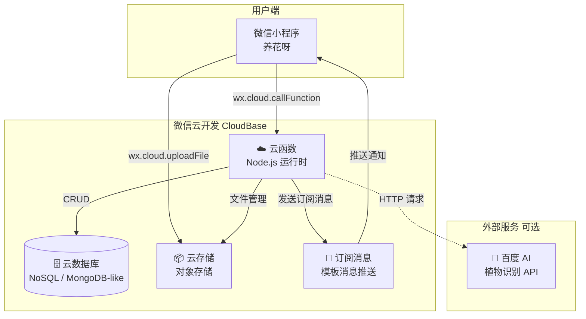
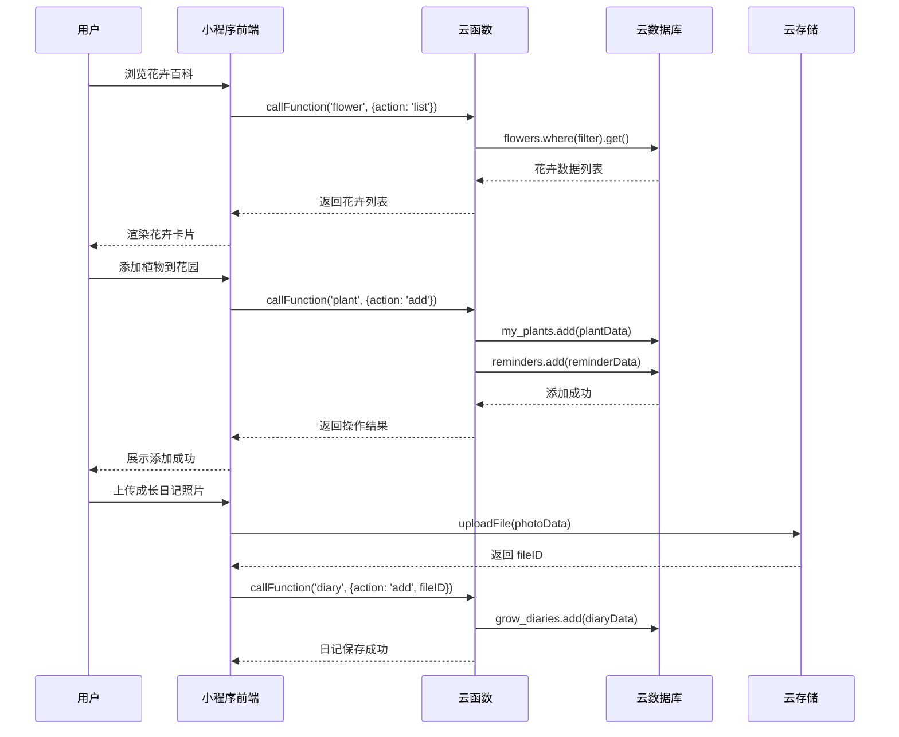
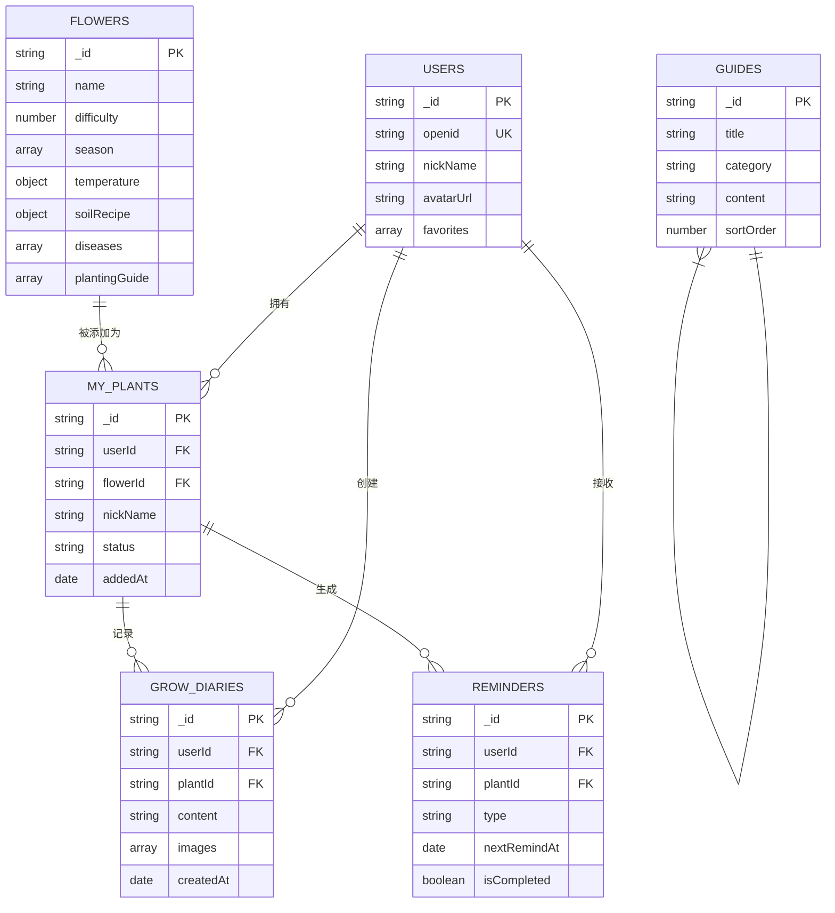
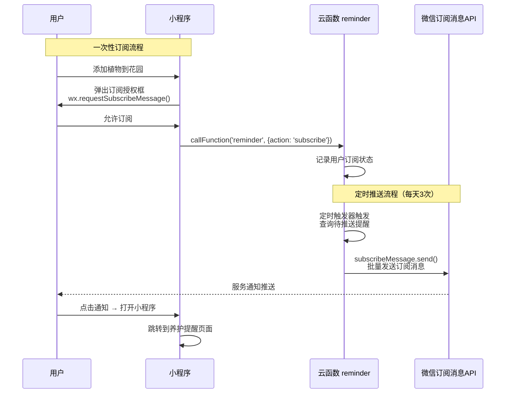
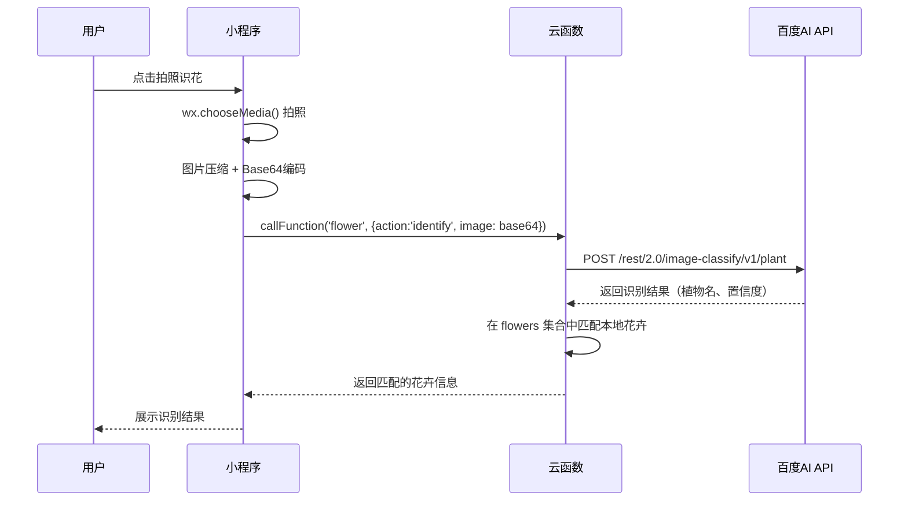

# 🏗️ 养花呀（Flora）— 技术设计文档

> **文档版本**：v1.0  
> **创建日期**：2026-04-28  
> **项目代号**：Flora（`flora-miniprogram`）  
> **技术栈**：微信小程序原生开发 + 微信云开发  
> **关联文档**：[PRD-养花呀产品需求文档](./PRD-花卉种植助手产品需求文档.md)

---

## 目录

- [1. 架构概览](#1-架构概览)
- [2. 技术选型](#2-技术选型)
- [3. 数据库设计](#3-数据库设计)
- [4. 云函数接口设计](#4-云函数接口设计)
- [5. 云存储方案](#5-云存储方案)
- [6. 订阅消息设计](#6-订阅消息设计)
- [7. 拍照识花方案](#7-拍照识花方案)
- [8. 安全设计](#8-安全设计)
- [9. 性能优化策略](#9-性能优化策略)
- [10. 部署与环境管理](#10-部署与环境管理)

---

## 1. 架构概览

### 1.1 整体架构图



### 1.2 架构说明

| 层级 | 说明 |
|------|------|
| **前端层** | 微信小程序原生开发（WXML + WXSS + JS），4 个 Tab 页面 + 若干子页面 |
| **逻辑层** | 云函数（Node.js 18+），按业务域拆分，每个云函数内部路由分发 |
| **数据层** | 云数据库（NoSQL），5 个核心集合 + 2 个辅助集合 |
| **存储层** | 云存储，花卉图片 + 用户上传图片，CDN 加速 |
| **消息层** | 微信订阅消息，养护提醒定时推送 |

### 1.3 数据流向



---

## 2. 技术选型

### 2.1 前端技术

| 技术 | 选型 | 说明 |
|------|------|------|
| 开发框架 | **微信小程序原生** | 无额外框架依赖，性能最佳，官方文档完善 |
| UI 组件库 | **WeUI / Vant Weapp**（可选） | 提供基础 UI 组件，加速开发 |
| CSS 预处理 | 原生 WXSS | 支持 rpx 自适应单位 |
| 状态管理 | **全局 globalData + 页面 data** | 项目规模适中，无需引入 MobX 等 |
| 图表展示 | **wx-charts** 或 **ECharts 微信版**（可选） | 花园统计数据可视化 |

### 2.2 后端技术（云开发）

| 技术 | 选型 | 说明 |
|------|------|------|
| 云函数运行时 | **Node.js 18+** | 微信云开发官方支持 |
| 云数据库 | **云开发数据库**（兼容 MongoDB） | NoSQL 文档型数据库 |
| 文件存储 | **云存储** | 自带 CDN 加速，直传不过服务器 |
| 定时触发 | **云函数定时触发器** | 用于养护提醒批处理推送 |
| 消息推送 | **微信订阅消息** | 一次性订阅 + 长期订阅 |

### 2.3 第三方服务（可选）

| 服务 | 用途 | 接入时机 |
|------|------|----------|
| 百度 AI 植物识别 | 拍照识花 | v2.0 |
| 微信 AI 开放能力 | 备选识花方案 | v2.0 |

### 2.4 开发工具

| 工具 | 说明 |
|------|------|
| 微信开发者工具 | 主要 IDE，调试、预览、上传 |
| VS Code | 代码编写（配合小程序插件） |
| Git | 版本管理 |

---

## 3. 数据库设计

### 3.1 集合总览



### 3.2 集合详细设计

#### 3.2.1 `flowers` — 花卉百科集合

> 存储所有花卉的百科信息，为全局只读数据（管理员维护）。

```javascript
{
  _id: "flower_001",                     // 文档ID（自动生成或手动指定）
  
  // === 基础信息 ===
  name: "月季",                           // 花卉名称
  alias: ["月月红", "玫瑰（通俗）"],       // 别名
  scientificName: "Rosa chinensis",       // 学名
  family: "蔷薇科蔷薇属",                 // 科属
  origin: "中国",                         // 原产地
  coverImage: "cloud://flora.xxx/flowers/yuejicoverpage.jpg",  // 封面图
  images: [                               // 图片列表
    "cloud://flora.xxx/flowers/yueji/1.jpg",
    "cloud://flora.xxx/flowers/yueji/2.jpg",
    "cloud://flora.xxx/flowers/yueji/3.jpg"
  ],
  description: "月季被誉为花中皇后，四季开花...",  // 简介
  
  // === 花语与文化 ===
  flowerLanguage: "爱情、美丽、希望",
  culturalMeaning: "在中国文化中，月季象征着...",
  giftScenarios: ["情人节", "母亲节", "生日"],
  
  // === 种植要素 ===
  difficulty: 3,                          // 难度 1-5
  difficultyDesc: "需要定期修剪和防病虫害",
  season: ["春", "秋"],                   // 适宜种植季节
  bloomSeason: ["4月", "5月", "6月", "9月", "10月"],  // 花期
  temperature: {
    min: 15,
    max: 28,
    desc: "15-28℃最佳，冬季不低于5℃"
  },
  light: "全日照，每天至少6小时直射光",
  lightLevel: "强光",                     // 强光 | 半阴 | 耐阴
  humidity: "适中，40%-60%",
  
  // === 养护要点 ===
  waterDays: 3,                           // 浇水间隔天数（用于生成提醒）
  waterMethod: "见干见湿，夏季早晚浇水，冬季减少浇水...",
  waterSeasonTips: {
    spring: "每2-3天浇水一次，保持土壤微湿",
    summer: "每天早晚各浇一次，避免中午浇水",
    autumn: "每3-4天浇水一次",
    winter: "每周浇水一次，保持盆土偏干"
  },
  fertilizeDays: 15,                      // 施肥间隔天数
  fertilizeMethod: "生长期每15天施一次复合肥...",
  fertilizeType: "复合肥、有机肥、磷钾肥",
  pruningTips: "花后及时修剪残花，冬季重剪整形...",
  repotCycle: "每年春季换盆一次",
  indoorTips: "冬季气温低于5℃时搬入室内，保持光照",
  
  // === 土壤配比 ===
  soilRecipe: {
    name: "月季专用土",
    components: [
      { material: "泥炭土", ratio: 4, desc: "提供有机质和保水性" },
      { material: "珍珠岩", ratio: 2, desc: "增加透气性" },
      { material: "蛭石",   ratio: 1, desc: "保水保肥" },
      { material: "河沙",   ratio: 1, desc: "增加排水性" }
    ],
    tips: "可加入适量骨粉作底肥"
  },
  soilPH: "微酸性 pH 6.0-6.5",
  soilDrainage: "排水良好",
  
  // === 种植教程（分步骤）===
  plantingGuide: [
    {
      step: 1,
      title: "选种与准备",
      content: "选择健壮的月季苗，检查根系是否完整...",
      image: "cloud://flora.xxx/flowers/yueji/guide_step1.jpg",
      tips: "建议选择嫁接苗，更容易成活"
    },
    {
      step: 2,
      title: "盆土准备",
      content: "准备直径20cm以上的花盆...",
      image: "cloud://flora.xxx/flowers/yueji/guide_step2.jpg",
      tips: "花盆底部必须有排水孔"
    }
    // ... 更多步骤
  ],
  
  // === 病虫害防治 ===
  diseases: [
    {
      name: "白粉病",
      type: "病害",
      symptoms: "叶片表面出现白色粉状物...",
      cause: "高湿度、通风不良",
      prevention: "保持通风，避免叶面浇水",
      treatment: "喷施多菌灵或粉锈宁，每7天一次，连续3次",
      image: "cloud://flora.xxx/diseases/baifenbing.jpg"
    },
    {
      name: "蚜虫",
      type: "虫害",
      symptoms: "嫩芽和花蕾处聚集绿色/黑色小虫...",
      cause: "春季温暖潮湿环境",
      prevention: "定期检查嫩芽",
      treatment: "少量可用水冲洗，严重时喷施吡虫啉",
      image: "cloud://flora.xxx/diseases/yachong.jpg"
    }
  ],
  
  // === 分类标签 ===
  category: "观花植物",
  subCategory: "灌木花卉",
  tags: ["室外", "阳台", "庭院", "四季开花"],
  isIndoor: false,
  plantType: "木本",                      // 草本 | 木本 | 藤本 | 多肉
  
  // === 系统字段 ===
  viewCount: 0,                           // 浏览次数
  favoriteCount: 0,                       // 收藏次数
  sortOrder: 1,                           // 排序权重
  isPublished: true,                      // 是否发布
  createdAt: "2026-04-28T00:00:00.000Z",
  updatedAt: "2026-04-28T00:00:00.000Z"
}
```

**索引设计：**

| 索引字段 | 类型 | 用途 |
|----------|------|------|
| `name` | 单字段 | 名称搜索 |
| `difficulty` | 单字段 | 难度筛选 |
| `season` | 多值索引 | 季节筛选 |
| `category` | 单字段 | 分类筛选 |
| `plantType` | 单字段 | 植物类型筛选 |
| `isIndoor` | 单字段 | 室内/室外筛选 |
| `isPublished, sortOrder` | 组合索引 | 列表排序查询 |
| `tags` | 多值索引 | 标签筛选 |

---

#### 3.2.2 `users` — 用户集合

> 存储用户信息和偏好设置。

```javascript
{
  _id: "user_xxx",                        // 文档ID
  openid: "oXXXXX",                       // 微信 openid（唯一标识）
  unionid: "",                            // 微信 unionid（可选）
  
  // === 用户信息 ===
  nickName: "花花小姐",
  avatarUrl: "cloud://flora.xxx/avatars/user_xxx.jpg",
  gender: 0,                              // 0未知 1男 2女
  city: "深圳",
  province: "广东",
  
  // === 用户偏好 ===
  favorites: ["flower_001", "flower_015"], // 收藏的花卉ID
  experienceLevel: "beginner",            // beginner | intermediate | advanced
  
  // === 统计数据 ===
  stats: {
    plantCount: 5,                        // 花园中植物数量
    diaryCount: 23,                       // 日记总数
    totalDays: 120,                       // 养花总天数
    completedReminders: 89                // 完成的提醒次数
  },
  
  // === 订阅消息设置 ===
  subscription: {
    waterReminder: true,                  // 浇水提醒
    fertilizeReminder: true,              // 施肥提醒
    seasonAlert: true                     // 季节预警
  },
  
  // === 系统字段 ===
  lastLoginAt: "2026-04-28T10:00:00.000Z",
  createdAt: "2026-04-01T00:00:00.000Z",
  updatedAt: "2026-04-28T10:00:00.000Z"
}
```

**索引设计：**

| 索引字段 | 类型 | 用途 |
|----------|------|------|
| `openid` | 唯一索引 | 用户登录查询 |

**安全规则：**

```json
{
  "read": "doc._openid == auth.openid",
  "write": "doc._openid == auth.openid"
}
```

---

#### 3.2.3 `my_plants` — 我的植物集合

> 用户添加到花园中的植物实例。

```javascript
{
  _id: "plant_xxx",
  _openid: "oXXXXX",                     // 云开发自动写入
  
  // === 关联信息 ===
  userId: "user_xxx",
  flowerId: "flower_001",                 // 关联的花卉百科ID
  
  // === 植物信息 ===
  nickName: "我的小月季",                  // 用户自定义昵称
  photo: "cloud://flora.xxx/plants/plant_xxx_cover.jpg",  // 植物照片
  purchaseDate: "2026-03-15",             // 入手日期（可选）
  location: "阳台",                       // 放置位置
  notes: "朋友送的生日礼物",              // 备注
  
  // === 养护参数（继承自花卉百科，可自定义覆盖）===
  waterDays: 3,                           // 浇水间隔（可手动调整）
  fertilizeDays: 15,                      // 施肥间隔
  lastWateredAt: "2026-04-27T08:00:00.000Z",   // 上次浇水时间
  lastFertilizedAt: "2026-04-15T08:00:00.000Z", // 上次施肥时间
  
  // === 状态 ===
  status: "active",                       // active | removed | dead
  
  // === 系统字段 ===
  addedAt: "2026-03-15T00:00:00.000Z",
  updatedAt: "2026-04-28T10:00:00.000Z"
}
```

**索引设计：**

| 索引字段 | 类型 | 用途 |
|----------|------|------|
| `_openid, status` | 组合索引 | 查询用户的活跃植物 |
| `flowerId` | 单字段 | 关联花卉查询 |

**安全规则：**

```json
{
  "read": "doc._openid == auth.openid",
  "write": "doc._openid == auth.openid"
}
```

---

#### 3.2.4 `grow_diaries` — 成长日记集合

> 用户记录植物成长过程的日记数据。

```javascript
{
  _id: "diary_xxx",
  _openid: "oXXXXX",
  
  // === 关联信息 ===
  userId: "user_xxx",
  plantId: "plant_xxx",                   // 关联的植物ID
  flowerId: "flower_001",                 // 冗余花卉ID（便于查询）
  
  // === 日记内容 ===
  content: "今天发现月季长出了新芽，好开心！",  // 文字内容
  images: [                               // 照片列表（最多9张）
    "cloud://flora.xxx/diaries/diary_xxx_1.jpg",
    "cloud://flora.xxx/diaries/diary_xxx_2.jpg"
  ],
  
  // === 养护记录（可选，与日记一起记录）===
  careActions: [                          // 同时记录的养护操作
    { type: "water", desc: "浇了透水" },
    { type: "fertilize", desc: "施了一次复合肥" }
  ],
  
  // === 天气信息（可选）===
  weather: "晴",
  temperature: "25℃",
  
  // === 系统字段 ===
  createdAt: "2026-04-28T08:30:00.000Z",
  updatedAt: "2026-04-28T08:30:00.000Z"
}
```

**索引设计：**

| 索引字段 | 类型 | 用途 |
|----------|------|------|
| `_openid, plantId, createdAt` | 组合索引 | 查询某植物的日记时间线 |
| `_openid, createdAt` | 组合索引 | 查询用户所有日记 |

---

#### 3.2.5 `guides` — 种植指南集合

> 种植指南和教程内容，管理员维护的只读数据。

```javascript
{
  _id: "guide_001",
  
  // === 基础信息 ===
  title: "新手种花入门：从零开始的养花之旅",
  subtitle: "适合完全没有养花经验的新手阅读",
  coverImage: "cloud://flora.xxx/guides/guide_001_cover.jpg",
  
  // === 分类 ===
  category: "newbie",                     // 分类标识
  categoryName: "新手入门",               // 分类名称
  tags: ["新手", "入门", "基础"],
  
  // === 内容 ===
  summary: "本指南将从最基础的工具准备开始...",  // 摘要（列表页展示）
  content: "## 第一步：准备工具\n\n养花需要准备以下基本工具...",  // 正文（Markdown 格式）
  sections: [                             // 章节目录（辅助导航）
    { title: "准备工具", anchor: "prepare-tools" },
    { title: "选择花盆", anchor: "choose-pot" },
    { title: "配置土壤", anchor: "prepare-soil" }
  ],
  
  // === 关联花卉 ===
  relatedFlowers: ["flower_004", "flower_021"],  // 相关花卉推荐
  
  // === 系统字段 ===
  difficulty: "beginner",                 // beginner | intermediate | advanced
  readTime: 5,                            // 预计阅读时间（分钟）
  viewCount: 0,
  sortOrder: 1,
  isPublished: true,
  createdAt: "2026-04-28T00:00:00.000Z",
  updatedAt: "2026-04-28T00:00:00.000Z"
}
```

**指南分类定义：**

| category 标识 | 分类名称 | 说明 |
|---------------|----------|------|
| `newbie` | 新手入门 | 种花基础知识、工具准备 |
| `sowing` | 播种教程 | 各类播种方法（直播、育苗、扦插） |
| `soil` | 土壤配比 | 各类花卉的土壤配方 |
| `watering` | 浇水指南 | 浇水原则、方法、常见误区 |
| `fertilizing` | 施肥指南 | 肥料种类、施肥时机与方法 |
| `pest` | 病虫害防治 | 常见病虫害识别与防治 |
| `seasonal` | 季节养护 | 四季养护通用要点 |
| `advanced` | 进阶技巧 | 嫁接、水培、组合盆栽 |

**索引设计：**

| 索引字段 | 类型 | 用途 |
|----------|------|------|
| `category, sortOrder` | 组合索引 | 分类列表排序 |
| `isPublished` | 单字段 | 发布状态筛选 |

---

#### 3.2.6 `reminders` — 养护提醒集合

> 系统自动生成的养护提醒数据。

```javascript
{
  _id: "reminder_xxx",
  _openid: "oXXXXX",
  
  // === 关联信息 ===
  userId: "user_xxx",
  plantId: "plant_xxx",
  flowerId: "flower_001",
  plantNickName: "我的小月季",             // 冗余（展示用）
  flowerName: "月季",                     // 冗余（展示用）
  
  // === 提醒信息 ===
  type: "water",                          // water | fertilize | repot | season | custom
  typeName: "浇水提醒",
  title: "该给「我的小月季」浇水啦",
  description: "月季在春季每2-3天需要浇水一次，注意见干见湿",
  
  // === 时间信息 ===
  nextRemindAt: "2026-04-30T08:00:00.000Z",  // 下次提醒时间
  intervalDays: 3,                             // 提醒间隔天数
  remindTime: "08:00",                         // 每日提醒时间
  
  // === 状态 ===
  isCompleted: false,                     // 本次是否已完成
  completedAt: null,                      // 完成时间
  isPushed: false,                        // 是否已推送订阅消息
  
  // === 系统字段 ===
  createdAt: "2026-04-28T00:00:00.000Z",
  updatedAt: "2026-04-28T00:00:00.000Z"
}
```

**索引设计：**

| 索引字段 | 类型 | 用途 |
|----------|------|------|
| `_openid, nextRemindAt` | 组合索引 | 查询用户的提醒列表（按时间排序） |
| `_openid, isCompleted, nextRemindAt` | 组合索引 | 查询未完成的提醒 |
| `isPushed, nextRemindAt` | 组合索引 | 定时任务：查找需要推送的提醒 |

---

#### 3.2.7 `daily_tips` — 每日小贴士集合

> 首页「养花小贴士」的内容数据。

```javascript
{
  _id: "tip_001",
  content: "浇花时最好使用晾晒过的自来水，可以去除氯气对植物根系的伤害。",
  category: "watering",                   // 分类
  season: "all",                          // all | spring | summer | autumn | winter
  sortOrder: 1,
  isPublished: true,
  createdAt: "2026-04-28T00:00:00.000Z"
}
```

---

### 3.3 集合数据量预估

| 集合 | 初始数据量 | 月增长量（1万用户） | 数据特征 |
|------|-----------|-------------------|----------|
| `flowers` | 50 条 | ~2条/月（新增花卉） | 只读，单条数据较大 |
| `users` | 0 | ~10,000条/月 | 读多写少 |
| `my_plants` | 0 | ~30,000条/月（人均3株） | 读写均衡 |
| `grow_diaries` | 0 | ~50,000条/月 | 写多读少，含图片引用 |
| `reminders` | 0 | ~60,000条/月（随植物自动生成） | 频繁读写更新 |
| `guides` | 30 条 | ~5条/月 | 只读 |
| `daily_tips` | 100 条 | ~10条/月 | 只读 |

---

## 4. 云函数接口设计

### 4.1 云函数总览

采用「一个业务域一个云函数 + 内部路由分发」的模式，减少冷启动次数。

| 云函数名 | 业务域 | 说明 |
|----------|--------|------|
| `flower` | 花卉百科 | 花卉查询、搜索、浏览统计 |
| `user` | 用户管理 | 登录、信息更新、收藏管理 |
| `plant` | 我的植物 | 添加/编辑/删除植物 |
| `diary` | 成长日记 | 日记的增删改查 |
| `reminder` | 养护提醒 | 提醒查询、完成打卡、推送服务 |
| `guide` | 种植指南 | 指南列表与详情 |
| `common` | 公共服务 | 首页数据聚合、每日贴士、上传配置等 |

### 4.2 云函数路由分发模板

每个云函数内部使用统一的路由分发结构：

```javascript
// cloudfunctions/flower/index.js
const cloud = require('wx-server-sdk')
cloud.init({ env: cloud.DYNAMIC_CURRENT_ENV })
const db = cloud.database()

// 引入各 action 处理器
const actions = {
  list: require('./actions/list'),
  detail: require('./actions/detail'),
  search: require('./actions/search'),
  recommend: require('./actions/recommend'),
}

exports.main = async (event, context) => {
  const { action, params = {} } = event
  const { OPENID } = cloud.getWXContext()

  if (!actions[action]) {
    return { code: -1, message: `未知操作: ${action}` }
  }

  try {
    const result = await actions[action]({ ...params, _openid: OPENID }, db)
    return { code: 0, data: result }
  } catch (err) {
    console.error(`[flower/${action}] 错误:`, err)
    return { code: -1, message: err.message || '服务异常' }
  }
}
```

### 4.3 各云函数接口详细设计

#### 4.3.1 `flower` — 花卉百科

##### `flower.list` — 获取花卉列表

```
调用方式: wx.cloud.callFunction({ name: 'flower', data: { action: 'list', params: {...} } })
```

| 参数 | 类型 | 必填 | 说明 |
|------|------|------|------|
| `page` | Number | ❌ | 页码，默认 1 |
| `pageSize` | Number | ❌ | 每页数量，默认 20，最大 50 |
| `category` | String | ❌ | 分类筛选（观花植物/观叶植物/多肉植物/果蔬花卉） |
| `plantType` | String | ❌ | 植物类型（草本/木本/藤本/多肉） |
| `difficulty` | Number | ❌ | 难度筛选（1-5） |
| `season` | String | ❌ | 季节筛选（春/夏/秋/冬） |
| `isIndoor` | Boolean | ❌ | 是否室内植物 |
| `sortBy` | String | ❌ | 排序方式：`default` / `difficulty_asc` / `popular` |

**返回值：**

```javascript
{
  code: 0,
  data: {
    list: [
      {
        _id: "flower_001",
        name: "月季",
        coverImage: "cloud://...",
        difficulty: 3,
        category: "观花植物",
        plantType: "木本",
        season: ["春", "秋"],
        tags: ["室外", "四季开花"],
        flowerLanguage: "爱情、美丽、希望",
        isIndoor: false
      }
      // ...
    ],
    total: 50,
    page: 1,
    pageSize: 20
  }
}
```

##### `flower.detail` — 获取花卉详情

| 参数 | 类型 | 必填 | 说明 |
|------|------|------|------|
| `flowerId` | String | ✅ | 花卉ID |

**返回值**：完整的花卉文档数据（参见 3.2.1 集合结构）+ `viewCount` 自增。

##### `flower.search` — 搜索花卉

| 参数 | 类型 | 必填 | 说明 |
|------|------|------|------|
| `keyword` | String | ✅ | 搜索关键词 |
| `page` | Number | ❌ | 页码 |
| `pageSize` | Number | ❌ | 每页数量 |

**搜索逻辑**：匹配 `name`、`alias`、`tags` 字段（使用正则模糊匹配）。

##### `flower.recommend` — 获取推荐花卉

| 参数 | 类型 | 必填 | 说明 |
|------|------|------|------|
| `type` | String | ✅ | 推荐类型：`today`（今日推荐）/ `season`（当季推荐）/ `hot`（热门） |
| `limit` | Number | ❌ | 返回数量，默认 3 |

---

#### 4.3.2 `user` — 用户管理

##### `user.login` — 用户登录/注册

> 首次登录自动创建用户记录。

| 参数 | 类型 | 必填 | 说明 |
|------|------|------|------|
| `nickName` | String | ❌ | 昵称 |
| `avatarUrl` | String | ❌ | 头像URL |

**返回值：**

```javascript
{
  code: 0,
  data: {
    userId: "user_xxx",
    isNewUser: true,           // 是否新注册
    userInfo: { /* 用户信息 */ }
  }
}
```

##### `user.updateInfo` — 更新用户信息

| 参数 | 类型 | 必填 | 说明 |
|------|------|------|------|
| `nickName` | String | ❌ | 昵称 |
| `avatarUrl` | String | ❌ | 头像URL |
| `city` | String | ❌ | 所在城市 |
| `experienceLevel` | String | ❌ | 经验等级 |

##### `user.toggleFavorite` — 收藏/取消收藏花卉

| 参数 | 类型 | 必填 | 说明 |
|------|------|------|------|
| `flowerId` | String | ✅ | 花卉ID |

**返回值**：`{ isFavorited: true/false }`

##### `user.getFavorites` — 获取收藏列表

| 参数 | 类型 | 必填 | 说明 |
|------|------|------|------|
| `page` | Number | ❌ | 页码 |
| `pageSize` | Number | ❌ | 每页数量 |

##### `user.getStats` — 获取用户统计数据

无参数，根据 openid 自动查询。

---

#### 4.3.3 `plant` — 我的植物

##### `plant.add` — 添加植物到花园

| 参数 | 类型 | 必填 | 说明 |
|------|------|------|------|
| `flowerId` | String | ✅ | 花卉百科ID |
| `nickName` | String | ❌ | 自定义昵称 |
| `photo` | String | ❌ | 植物照片 fileID |
| `location` | String | ❌ | 放置位置 |
| `purchaseDate` | String | ❌ | 入手日期 |
| `notes` | String | ❌ | 备注 |

**处理逻辑：**
1. 在 `my_plants` 集合中创建植物记录
2. 从 `flowers` 集合中获取该花卉的养护参数（`waterDays`、`fertilizeDays`）
3. 自动在 `reminders` 集合中创建浇水提醒和施肥提醒
4. 更新用户统计数据 `stats.plantCount`

##### `plant.list` — 获取我的植物列表

| 参数 | 类型 | 必填 | 说明 |
|------|------|------|------|
| `status` | String | ❌ | 筛选状态：`active` / `removed` / `all`，默认 `active` |

##### `plant.update` — 更新植物信息

| 参数 | 类型 | 必填 | 说明 |
|------|------|------|------|
| `plantId` | String | ✅ | 植物ID |
| `nickName` | String | ❌ | 新昵称 |
| `photo` | String | ❌ | 新照片 |
| `waterDays` | Number | ❌ | 自定义浇水间隔 |
| `fertilizeDays` | Number | ❌ | 自定义施肥间隔 |

##### `plant.remove` — 移除植物

| 参数 | 类型 | 必填 | 说明 |
|------|------|------|------|
| `plantId` | String | ✅ | 植物ID |

**处理逻辑**：将状态改为 `removed`，取消相关提醒（不删除历史记录）。

---

#### 4.3.4 `diary` — 成长日记

##### `diary.add` — 添加日记

| 参数 | 类型 | 必填 | 说明 |
|------|------|------|------|
| `plantId` | String | ✅ | 植物ID |
| `content` | String | ✅ | 日记文字内容（限 500 字） |
| `images` | Array\<String\> | ❌ | 图片 fileID 列表（最多 9 张） |
| `careActions` | Array | ❌ | 同时记录的养护操作 |
| `weather` | String | ❌ | 天气信息 |
| `temperature` | String | ❌ | 温度信息 |

##### `diary.list` — 获取日记列表

| 参数 | 类型 | 必填 | 说明 |
|------|------|------|------|
| `plantId` | String | ❌ | 指定植物ID（不传则查所有） |
| `page` | Number | ❌ | 页码 |
| `pageSize` | Number | ❌ | 每页数量，默认 10 |

**返回值**：按 `createdAt` 降序排列的日记列表。

##### `diary.delete` — 删除日记

| 参数 | 类型 | 必填 | 说明 |
|------|------|------|------|
| `diaryId` | String | ✅ | 日记ID |

**处理逻辑**：同时删除关联的云存储图片。

---

#### 4.3.5 `reminder` — 养护提醒

##### `reminder.list` — 获取提醒列表

| 参数 | 类型 | 必填 | 说明 |
|------|------|------|------|
| `type` | String | ❌ | 提醒类型筛选 |
| `isCompleted` | Boolean | ❌ | 完成状态筛选 |
| `dateRange` | Object | ❌ | `{ start: "2026-04-28", end: "2026-05-05" }` |

##### `reminder.complete` — 完成提醒打卡

| 参数 | 类型 | 必填 | 说明 |
|------|------|------|------|
| `reminderId` | String | ✅ | 提醒ID |

**处理逻辑：**
1. 标记当前提醒为已完成（`isCompleted: true`）
2. 更新对应植物的 `lastWateredAt` 或 `lastFertilizedAt`
3. 自动计算并创建下一次提醒记录
4. 更新用户统计 `stats.completedReminders`

##### `reminder.push`（定时触发） — 推送提醒消息

> 由定时触发器调用，不对外暴露。

**触发频率**：每天 7:00、12:00、18:00 各执行一次

**处理逻辑：**
1. 查询当前时间之前未推送的提醒（`isPushed: false && nextRemindAt <= now`）
2. 批量发送订阅消息
3. 标记已推送（`isPushed: true`）

---

#### 4.3.6 `guide` — 种植指南

##### `guide.list` — 获取指南列表

| 参数 | 类型 | 必填 | 说明 |
|------|------|------|------|
| `category` | String | ❌ | 分类筛选 |
| `difficulty` | String | ❌ | 难度筛选 |
| `page` | Number | ❌ | 页码 |
| `pageSize` | Number | ❌ | 每页数量 |

##### `guide.detail` — 获取指南详情

| 参数 | 类型 | 必填 | 说明 |
|------|------|------|------|
| `guideId` | String | ✅ | 指南ID |

---

#### 4.3.7 `common` — 公共服务

##### `common.getHomeData` — 获取首页聚合数据

无参数。

**返回值：**

```javascript
{
  code: 0,
  data: {
    todayRecommend: [ /* 今日推荐花卉 1-3 条 */ ],
    dailyTip: { /* 今日养花小贴士 */ },
    seasonFlowers: [ /* 当季花历花卉列表 */ ],
    myReminders: [ /* 用户今日待办提醒（已登录时） */ ]
  }
}
```

##### `common.getDailyTip` — 获取每日贴士

无参数。按日期轮播返回一条贴士。

---

### 4.4 云函数定时触发器

| 云函数 | 触发器名称 | CRON 表达式 | 说明 |
|--------|-----------|------------|------|
| `reminder` | `push_morning` | `0 0 7 * * * *` | 每天早上 7:00 推送提醒 |
| `reminder` | `push_noon` | `0 0 12 * * * *` | 每天中午 12:00 推送提醒 |
| `reminder` | `push_evening` | `0 0 18 * * * *` | 每天傍晚 18:00 推送提醒 |

**定时触发器配置文件（`config.json`）**：

```json
{
  "triggers": [
    {
      "name": "push_morning",
      "type": "timer",
      "config": "0 0 7 * * * *"
    },
    {
      "name": "push_noon",
      "type": "timer",
      "config": "0 0 12 * * * *"
    },
    {
      "name": "push_evening",
      "type": "timer",
      "config": "0 0 18 * * * *"
    }
  ]
}
```

---

## 5. 云存储方案

### 5.1 目录结构规划

```
cloud://flora-env-xxx/
├── flowers/                          # 花卉百科图片
│   ├── yueji/                       # 按花卉拼音分目录
│   │   ├── cover.jpg                # 封面图
│   │   ├── 1.jpg                    # 详情图
│   │   ├── 2.jpg
│   │   ├── guide_step1.jpg          # 种植教程步骤图
│   │   └── guide_step2.jpg
│   ├── moli/
│   └── ...
│
├── diseases/                         # 病虫害图片
│   ├── baifenbing.jpg
│   ├── yachong.jpg
│   └── ...
│
├── guides/                           # 指南配图
│   ├── guide_001_cover.jpg
│   └── ...
│
├── avatars/                          # 用户头像
│   └── user_xxx.jpg
│
├── plants/                           # 用户植物照片
│   └── plant_xxx_cover.jpg
│
└── diaries/                          # 成长日记照片
    ├── diary_xxx_1.jpg
    └── diary_xxx_2.jpg
```

### 5.2 图片规格要求

| 用途 | 格式 | 最大尺寸 | 建议尺寸 | 说明 |
|------|------|----------|----------|------|
| 花卉封面图 | JPG/WebP | 500KB | 750×750px | 正方形，列表卡片使用 |
| 花卉详情图 | JPG/WebP | 1MB | 1080×1440px | 4:3 竖图 |
| 种植教程步骤图 | JPG/WebP | 500KB | 1080×810px | 4:3 横图 |
| 病虫害配图 | JPG/WebP | 300KB | 750×750px | 正方形 |
| 指南封面图 | JPG/WebP | 300KB | 1080×600px | 16:9 横图 |
| 用户头像 | JPG/PNG | 200KB | 300×300px | 正方形 |
| 日记照片 | JPG/PNG/WebP | 5MB | 用户上传原图 | 前端压缩后上传 |

### 5.3 图片处理策略

```javascript
// 前端上传前压缩（utils/image.js）
function compressImage(src, quality = 80) {
  return new Promise((resolve, reject) => {
    wx.compressImage({
      src,
      quality,
      success: res => resolve(res.tempFilePath),
      fail: reject
    })
  })
}

// 上传到云存储
async function uploadImage(filePath, cloudPath) {
  const res = await wx.cloud.uploadFile({
    cloudPath,                    // 云存储路径
    filePath                      // 本地文件路径
  })
  return res.fileID               // 返回 fileID
}
```

### 5.4 云存储安全规则

```json
{
  "read": true,
  "write": "auth.openid == resource.openid"
}
```

- **读取**：所有用户可读取花卉百科图片等公开资源
- **写入**：只有文件所有者可以上传/删除自己的图片

---

## 6. 订阅消息设计

### 6.1 消息模板设计

#### 模板 1：养护提醒通知

> 需要在「微信公众平台 → 订阅消息」中申请或从模板库选择。

| 模板字段 | 参数名 | 类型 | 示例 |
|----------|--------|------|------|
| 植物名称 | `thing1` | thing | 我的小月季 |
| 提醒类型 | `thing2` | thing | 浇水提醒 |
| 提醒内容 | `thing3` | thing | 月季在春季每2-3天需要浇水一次 |
| 提醒时间 | `time4` | time | 2026年4月30日 08:00 |

#### 模板 2：季节养护预警（v1.5）

| 模板字段 | 参数名 | 类型 | 示例 |
|----------|--------|------|------|
| 预警标题 | `thing1` | thing | 入冬养护提醒 |
| 相关植物 | `thing2` | thing | 月季、栀子花、三角梅 |
| 预警内容 | `thing3` | thing | 气温将降至5℃以下，请及时将植物搬入室内 |
| 预警时间 | `time4` | time | 2026年11月15日 |

### 6.2 订阅消息推送流程



### 6.3 订阅策略

| 策略 | 说明 |
|------|------|
| **订阅时机** | 用户添加植物时引导订阅、完成打卡后引导续订 |
| **频率控制** | 每天最多推送 3 条（合并同一时间段的多个提醒） |
| **兜底方案** | 用户未授权订阅时，在小程序内提供「提醒中心」展示待办事项 |
| **再次引导** | 若用户拒绝订阅，在养护提醒页面提供手动开启入口 |

### 6.4 推送云函数核心代码

```javascript
// cloudfunctions/reminder/actions/push.js
const cloud = require('wx-server-sdk')

async function pushReminders(params, db) {
  const now = new Date()
  
  // 1. 查询需要推送的提醒
  const { data: reminders } = await db.collection('reminders')
    .where({
      isPushed: false,
      isCompleted: false,
      nextRemindAt: db.command.lte(now)
    })
    .limit(100)
    .get()

  if (reminders.length === 0) return { pushed: 0 }

  // 2. 按用户分组
  const userReminders = {}
  reminders.forEach(r => {
    if (!userReminders[r._openid]) userReminders[r._openid] = []
    userReminders[r._openid].push(r)
  })

  let pushedCount = 0

  // 3. 逐用户发送订阅消息
  for (const [openid, items] of Object.entries(userReminders)) {
    // 合并同一用户的提醒（最多发3条）
    const toSend = items.slice(0, 3)

    for (const item of toSend) {
      try {
        await cloud.openapi.subscribeMessage.send({
          touser: openid,
          templateId: 'YOUR_TEMPLATE_ID',
          page: '/pages/reminder/index',
          data: {
            thing1: { value: item.plantNickName },
            thing2: { value: item.typeName },
            thing3: { value: item.description.slice(0, 20) },
            time4: { value: formatTime(item.nextRemindAt) }
          }
        })

        // 标记已推送
        await db.collection('reminders').doc(item._id).update({
          data: { isPushed: true, updatedAt: now }
        })

        pushedCount++
      } catch (err) {
        console.error(`推送失败 [${openid}]:`, err)
        // 用户拒绝接收时的错误码 43101 可忽略
      }
    }
  }

  return { pushed: pushedCount }
}

function formatTime(date) {
  const d = new Date(date)
  return `${d.getFullYear()}年${d.getMonth()+1}月${d.getDate()}日 ${String(d.getHours()).padStart(2,'0')}:${String(d.getMinutes()).padStart(2,'0')}`
}

module.exports = pushReminders
```

---

## 7. 拍照识花方案（v2.0）

### 7.1 方案对比

| 方案 | 提供方 | 优点 | 缺点 | 费用 |
|------|--------|------|------|------|
| 百度 AI 植物识别 | 百度 | 识别准确率高，支持 5000+ 种植物 | 需要注册百度 AI 开放平台 | 免费额度 500次/天 |
| 腾讯 AI 图像识别 | 腾讯 | 与小程序生态更贴近 | 植物品类覆盖较少 | 有免费额度 |
| 微信 AI 开放能力 | 微信 | 原生支持，无需额外接入 | 仅支持基础分类 | 免费 |

### 7.2 推荐方案：百度 AI 植物识别



---

## 8. 安全设计

### 8.1 数据安全规则

| 集合 | 读权限 | 写权限 | 说明 |
|------|--------|--------|------|
| `flowers` | 所有用户 | 管理员 | 花卉百科为公开只读数据 |
| `guides` | 所有用户 | 管理员 | 种植指南为公开只读数据 |
| `daily_tips` | 所有用户 | 管理员 | 每日贴士为公开只读数据 |
| `users` | 仅本人 | 仅本人 | 用户只能读写自己的数据 |
| `my_plants` | 仅本人 | 仅本人 | 用户只能读写自己的植物 |
| `grow_diaries` | 仅本人 | 仅本人 | 用户只能读写自己的日记 |
| `reminders` | 仅本人 | 仅本人 | 用户只能读写自己的提醒 |

### 8.2 云函数安全

- 所有写操作通过云函数执行，不在前端直接操作数据库
- 云函数内校验 `_openid`，确保用户只操作自己的数据
- 输入参数校验：长度限制、类型检查、XSS 过滤

### 8.3 图片上传安全

- 限制上传格式：`jpg / jpeg / png / webp`
- 限制文件大小：≤ 5MB
- 云存储路径包含用户 openid，防止路径冲突
- 图片审核：可接入微信内容安全 API（`security.imgSecCheck`）

---

## 9. 性能优化策略

### 9.1 前端优化

| 策略 | 说明 | 优先级 |
|------|------|--------|
| **图片懒加载** | 列表页使用 `lazy-load` 属性，可视区域外图片不加载 | P0 |
| **分包加载** | 首页主包，百科/指南/花园/个人中心为分包 | P0 |
| **数据缓存** | 花卉列表、指南列表使用本地缓存，设置 5 分钟过期 | P1 |
| **骨架屏** | 列表页和详情页加载时展示骨架屏 | P1 |
| **图片压缩** | 上传前压缩到 80% 质量，使用 WebP 格式 | P0 |
| **setData 优化** | 减少 setData 调用频率，合并数据更新 | P1 |

### 9.2 分包配置

```json
// app.json
{
  "pages": [
    "pages/index/index"
  ],
  "subPackages": [
    {
      "root": "pages/encyclopedia",
      "pages": ["index", "detail"]
    },
    {
      "root": "pages/guide",
      "pages": ["index", "detail"]
    },
    {
      "root": "pages/garden",
      "pages": ["index", "plant-detail", "diary-edit"]
    },
    {
      "root": "pages/reminder",
      "pages": ["index"]
    },
    {
      "root": "pages/profile",
      "pages": ["index"]
    }
  ],
  "preloadRule": {
    "pages/index/index": {
      "network": "all",
      "packages": ["pages/encyclopedia"]
    }
  }
}
```

### 9.3 后端优化

| 策略 | 说明 |
|------|------|
| **索引优化** | 高频查询字段建立索引（见各集合索引设计） |
| **字段投影** | 列表查询只返回必要字段，不返回大文本字段 |
| **分页查询** | 所有列表查询启用分页，默认 20 条/页 |
| **聚合查询** | 首页数据使用聚合管道一次查询多类数据 |
| **冷启动优化** | 云函数使用缓存全局变量，减少重复初始化 |

---

## 10. 部署与环境管理

### 10.1 环境规划

| 环境 | 用途 | 环境ID |
|------|------|--------|
| **开发环境** | 本地开发调试 | `flora-dev-xxx` |
| **生产环境** | 正式发布使用 | `flora-prod-xxx` |

### 10.2 云开发初始化

```javascript
// app.js
App({
  onLaunch() {
    wx.cloud.init({
      env: 'flora-prod-xxx',  // 生产环境ID
      traceUser: true          // 自动记录用户访问
    })
  }
})
```

### 10.3 数据初始化

1. **花卉数据**：通过云开发控制台批量导入 JSON 数据
2. **种植指南**：通过云函数脚本批量写入
3. **每日贴士**：通过云开发控制台手动录入

### 10.4 上线检查清单

- [ ] 云开发环境创建并配置
- [ ] 所有集合创建并设置安全规则
- [ ] 索引创建完成
- [ ] 云函数部署并测试
- [ ] 定时触发器配置并启用
- [ ] 订阅消息模板申请通过
- [ ] 花卉基础数据导入完成（≥ 30 种）
- [ ] 种植指南内容录入完成（≥ 10 篇）
- [ ] 图片资源上传到云存储
- [ ] 分包加载配置并测试
- [ ] 性能测试通过（首屏 ≤ 2s）
- [ ] 体验版测试 → 提交审核 → 正式发布

---

> 📝 **文档更新记录**
>
> | 版本 | 日期 | 修改内容 | 作者 |
> |------|------|----------|------|
> | v1.0 | 2026-04-28 | 初稿创建 | AI Assistant |
